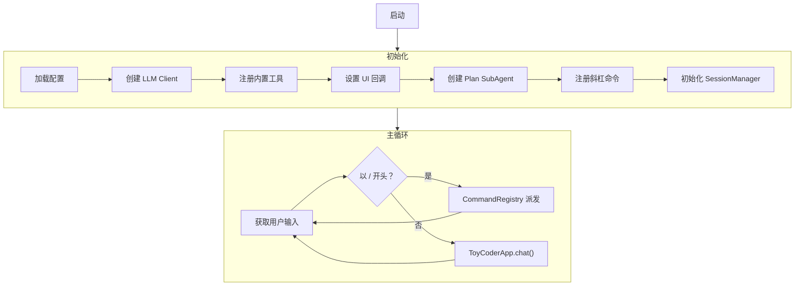
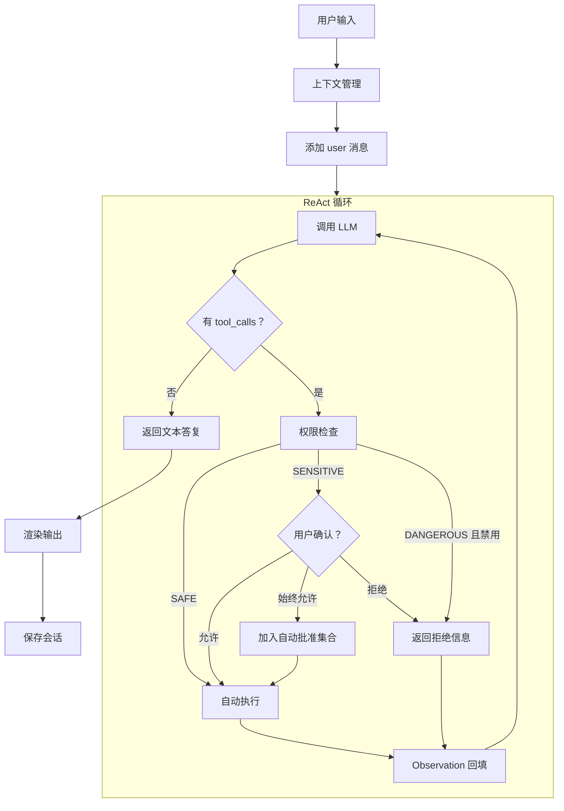
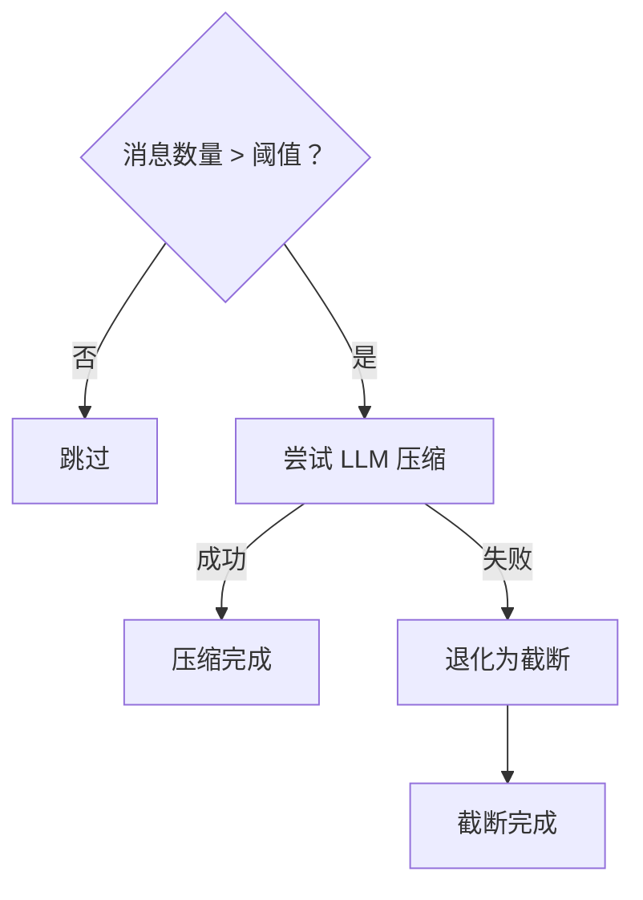
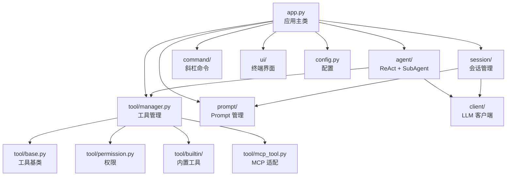

笔者认为，**设计优先于实现**，在开发任何复杂系统之前，明确功能需求、设计流程和模块划分是至关重要的。在本篇中，笔者将介绍 ToyCoder 的功能需求、整体流程设计和模块划分，帮助读者在阅读源码之前先建立起对项目架构的全局认知。

## 功能需求

### ToyCoder 是什么

ToyCoder 是一个 **TUI（终端用户界面）Coding Agent**。用户在终端中以自然语言描述编程需求，ToyCoder 会自主阅读代码、制定计划、编写和修改文件、执行命令，直到任务完成。它的定位类似于一个终端里的 AI 编程助手。

为什么选择 TUI 而不是 Web 界面？原因很简单：Coding Agent 的使用场景天然就是终端。开发者在终端中编写代码、运行命令、查看日志，一个同样运行在终端中的 Agent 可以最自然地融入这个工作流。

### 功能清单

根据一个 Coding Agent 的基本需求，笔者梳理出以下功能点：

核心功能：
- 代码阅读：读取文件内容，理解代码结构。
- 代码搜索：按文件名模式搜索（glob）和按内容搜索（grep）。
- 代码编写：创建新文件、精确编辑已有文件的指定位置。
- 命令执行：在 shell 中执行命令（如运行测试、安装依赖等）。
- 任务规划：对于复杂任务，先制定计划再按步骤执行。
- 主动提问：当任务不明确时，主动向用户询问以明确需求。

交互功能：
- 多会话管理：支持创建、切换、恢复多个独立的对话会话。
- 斜杠命令：通过 `/help`、`/new`、`/tools` 等命令控制应用行为。
- 上下文管理：对话过长时自动压缩或截断历史消息。
- 工具权限控制：不同工具有不同的安全等级，敏感操作需确认，危险操作默认禁用。

可配置性：
- 多服务商支持：通过配置文件切换不同的 LLM 服务商和模型。
- MCP 集成：支持通过 MCP 协议接入外部工具服务。

### 配置设计

ToyCoder 使用 YAML 配置文件来管理所有外部依赖的配置。笔者在设计配置结构时遵循了以下原则：
1. 分层组织：按职责划分为服务商配置、Agent 配置、会话配置等。
2. 合理默认值：大部分配置项都有合理的默认值，用户只需填写 API Key 即可开始使用。
3. 可扩展：支持配置多个服务商，便于切换和对比。

```yaml
# config.yaml
providers:
  openai:
    api_keys:
      - "sk-your-api-key-here"
    base_url: "https://api.openai.com/v1"
    models:
      default: "gpt-4o"
      fast: "gpt-4o-mini"

default_provider: "openai"

agent:
  max_steps: 16        # ReAct 循环最大步数
  max_retries: 2       # API 调用最大重试次数
  retry_interval: 1.0  # 重试间隔（秒）

session:
  max_messages: 50           # 触发上下文管理的消息数量阈值
  compress_keep_recent: 8    # 压缩时保留的最近消息条数

mcp_servers: {}
```

这里值得注意的是 `providers` 的设计——每个服务商下包含 `api_keys`（数组，支持多 Key 轮询）、`base_url` 和 `models`。这与我们在[基础篇 3](/posts/agent-dev-basis-3)中封装的 `OpenAIClient` 的设计思路是一致的：通过 `base_url` 适配不同服务商，通过多个 API Key 实现负载均衡。

### 内置工具设计

在工具的设计上，笔者依据 Coding Agent 的需求将工具分为以下几组，并按照[进阶篇 4](/posts/agent-dev-advanced-4)中介绍的权限模型为每个工具标注了安全等级：

| 工具 | 功能 | 权限等级 |
|------|------|----------|
| `read_file` | 读取文件内容（支持分页） | SAFE |
| `list_directory` | 列出目录内容 | SAFE |
| `glob_search` | 按文件名模式搜索 | SAFE |
| `grep_search` | 按内容正则搜索 | SAFE |
| `ask_user` | 向用户提问 | SAFE |
| `write_file` | 创建/覆盖文件 | SENSITIVE |
| `edit_file` | 精确字符串替换编辑 | SENSITIVE |
| `run_command` | 执行 shell 命令 | DANGEROUS |
| `planner` | 任务规划（SubAgent） | SAFE |

权限等级的划分逻辑是：
- **SAFE**：只读操作或无副作用的操作，自动执行。
- **SENSITIVE**：会修改文件系统的写操作，每次调用前需要用户确认（确认后可以选择"始终允许"，授予会话级自动批准）。
- **DANGEROUS**：`run_command` 可以执行任意 shell 命令，风险极高，因此默认禁用，用户需要通过 `/tool enable run_command` 手动开启。

注意 `planner` 是一个比较特殊的工具——它实际上是一个 SubAgent（在[进阶篇 2](/posts/agent-dev-advanced-2)中介绍的架构），通过 `SubAgentTool` 适配为工具接口。当主 Agent 遇到复杂任务时，它可以调用 `planner` 来制定计划，然后按计划逐步执行。

### 斜杠命令设计

斜杠命令是 ToyCoder 的控制层，用于管理应用状态而不进入 Agent 对话流程：

| 命令 | 功能 |
|------|------|
| `/help` | 显示帮助信息 |
| `/new` | 创建新会话 |
| `/sessions` | 列出所有会话 |
| `/switch <id>` | 切换到指定会话 |
| `/tools` | 列出所有工具及其状态 |
| `/tool enable/disable <name>` | 启用/禁用指定工具 |
| `/model` | 显示当前模型信息 |
| `/quit` | 退出应用 |

斜杠命令的处理优先于 Agent 对话——在主循环中，以 `/` 开头的输入会被路由到 `CommandRegistry`，而不是进入 `chat()` 流程。

## 流程设计

### 整体工作流

ToyCoder 的完整工作流可以分为三个阶段：**初始化**、**主循环**和**Agent 执行**。



初始化阶段的顺序是经过设计的：先加载配置（因为后续所有组件都依赖配置），然后创建 Client（因为 SubAgent 需要 Client），接着注册工具（因为主 Agent 的工具集需要包含 SubAgent），最后初始化 SessionManager（因为 System Prompt 需要从 PromptManager 加载）。

### Agent 执行流程

当用户输入一条非命令消息时，`chat()` 方法会启动以下流程：



这里有几个设计要点值得说明：

1. **上下文管理先于消息追加**。在将用户的新消息加入 `messages` 之前，先检查上下文长度。如果对话历史已经过长，则先进行压缩（通过 LLM 生成摘要）或截断（保留最近的 N 轮），然后再追加新消息。这确保了 LLM 始终在合理的上下文窗口内工作。

2. **权限检查在 `ToolManager.dispatch` 内部完成**，对 ReAct 循环是透明的。ReAct 循环只管调用 `tool_manager.dispatch(name, args)`，权限拒绝的结果会作为普通的 Observation 返回给 LLM，LLM 可以据此调整策略。这样 ReAct 循环本身不需要关心权限逻辑。

3. **UI 回调通过依赖注入**。`run_react` 接受 `on_tool_call` 和 `on_tool_result` 两个可选回调，用于在工具调用时通知 UI 层渲染进度。同样，`ToolManager` 的确认回调和 `ask_user` 工具的交互回调也通过 setter 注入。这种设计使得 Agent 核心逻辑完全不依赖 UI 实现。

### 上下文管理流程

上下文管理的策略在[进阶篇 3](/posts/agent-dev-advanced-3)中已经介绍过原理，在 ToyCoder 中的具体实现采用压缩优先、截断兜底的策略：



压缩使用 `summarizer` Agent 的 Prompt 模板（定义在 `agents.yaml` 中），调用 LLM 将早期对话总结为一段摘要。如果压缩过程中 LLM 调用失败（如网络错误），则退化为简单截断，确保应用不会因为上下文管理失败而中断。

## 模块划分

### 项目结构

```
toycoder/
├── __init__.py          # 版本号
├── __main__.py          # CLI 入口
├── app.py               # 应用主类：组装所有模块
├── config.py            # 配置加载
├── agent/               # Agent 核心
│   ├── react.py         # ReAct 循环引擎
│   ├── sub_agent.py     # SubAgent 封装
│   └── sub_agent_tool.py # SubAgent → Tool 适配器
├── client/              # LLM 客户端
│   ├── base.py          # 抽象基类与数据模型
│   └── openai_client.py # OpenAI 兼容实现
├── command/             # 斜杠命令
│   ├── base.py          # Command 与 CommandRegistry
│   └── builtin.py       # 内置命令实现
├── prompt/              # Prompt 管理
│   ├── manager.py       # PromptManager
│   └── templates/       # YAML 模板
│       └── agents.yaml  # Agent 角色定义
├── session/             # 会话管理
│   └── manager.py       # Session 与 SessionManager
├── tool/                # 工具系统
│   ├── base.py          # Tool 基类
│   ├── manager.py       # ToolManager（注册/派发/权限）
│   ├── permission.py    # 权限等级枚举
│   ├── mcp_tool.py      # MCP 工具适配器
│   └── builtin/         # 内置工具
│       ├── file_ops.py  # 文件操作
│       ├── search.py    # 搜索
│       ├── shell.py     # Shell 命令
│       └── question.py  # 用户提问
└── ui/                  # 终端界面
    └── display.py       # Rich TUI 渲染
```

### 各模块的职责

每个模块的设计都对应了前面系列文章中介绍的某个概念或封装：

| 模块 | 职责 | 对应文章 |
|------|------|----------|
| `client/` | LLM 客户端抽象与实现，多 Key 轮询，重试机制 | [基础篇 3](/posts/agent-dev-basis-3) |
| `tool/base.py` | 从函数签名自动生成工具 Schema | [基础篇 3](/posts/agent-dev-basis-3) |
| `tool/manager.py` | 工具注册、派发、权限控制 | [基础篇 3](/posts/agent-dev-basis-3) + [进阶篇 4](/posts/agent-dev-advanced-4) |
| `tool/mcp_tool.py` | MCP 工具适配为本地 Tool 接口 | [进阶篇 1](/posts/agent-dev-advanced-1) |
| `agent/react.py` | ReAct 循环引擎 | [基础篇 3](/posts/agent-dev-basis-3) |
| `agent/sub_agent.py` | 独立上下文的 SubAgent | [进阶篇 2](/posts/agent-dev-advanced-2) |
| `agent/sub_agent_tool.py` | SubAgent → Tool 适配器 | [进阶篇 2](/posts/agent-dev-advanced-2) |
| `prompt/` | Prompt 模板的 YAML 管理与渲染 | [基础篇 4](/posts/agent-dev-basis-4) |
| `session/` | 多会话管理，上下文截断与压缩 | [进阶篇 3](/posts/agent-dev-advanced-3) |
| `tool/permission.py` | 工具权限等级 | [进阶篇 4](/posts/agent-dev-advanced-4) |
| `command/` | 斜杠命令的注册与派发 | 本项目新增 |
| `ui/` | 终端界面渲染 | 本项目新增 |
| `config.py` | YAML 配置加载 | 本项目新增 |
| `app.py` | 应用主类，组装所有模块 | 本项目新增 |

### 模块间的依赖关系

模块之间的依赖关系遵循一个清晰的分层结构：



依赖关系的关键设计原则是：
- **底层模块不依赖上层模块**。`client/`、`tool/base.py`、`prompt/` 等底层模块是完全自包含的，不依赖 `app.py` 或 `ui/`。
- **`app.py` 是唯一的组装点**。所有模块的实例化和组装都在 `ToyCoderApp.setup()` 中完成，各模块之间通过接口（而非具体实现）交互。
- **UI 与核心逻辑解耦**。Agent、Tool、Session 等核心模块完全不依赖 `ui/` 模块，它们通过回调函数与 UI 层通信。这意味着如果需要将 ToyCoder 从 TUI 改为 Web 界面，只需替换 `ui/` 和 `app.py` 中的回调设置，核心模块无需修改。

### 新增模块说明

相比前面文章中已经介绍过的模块，ToyCoder 还引入了三个新模块来满足实际应用的需求：

**`command/`——斜杠命令系统**

斜杠命令系统采用了与 `ToolManager` 类似的注册表模式。`CommandRegistry` 管理所有可用命令，`Command` 数据类描述命令的名称、处理函数、帮助文本和别名。内置命令通过 `register_builtin_commands()` 函数批量注册。

**`ui/`——终端界面**

UI 模块基于 [Rich](https://github.com/Textualize/rich) 库实现，提供了 Agent 回复的 Markdown 渲染、工具调用的进度展示、权限确认对话框等功能。所有 UI 函数都被设计为无状态的纯函数，通过回调注入到核心模块中。

**`config.py`——配置管理**

配置模块使用 `dataclass` 定义了类型安全的配置结构（`ProviderConfig`、`AgentConfig`、`SessionConfig` 等），并从 YAML 文件中加载。这种设计使得配置项在代码中有明确的类型和默认值，避免了字典访问时的 key 拼写错误问题。

在下一篇文章中，笔者将深入到代码层面，逐模块介绍 ToyCoder 的具体实现细节。