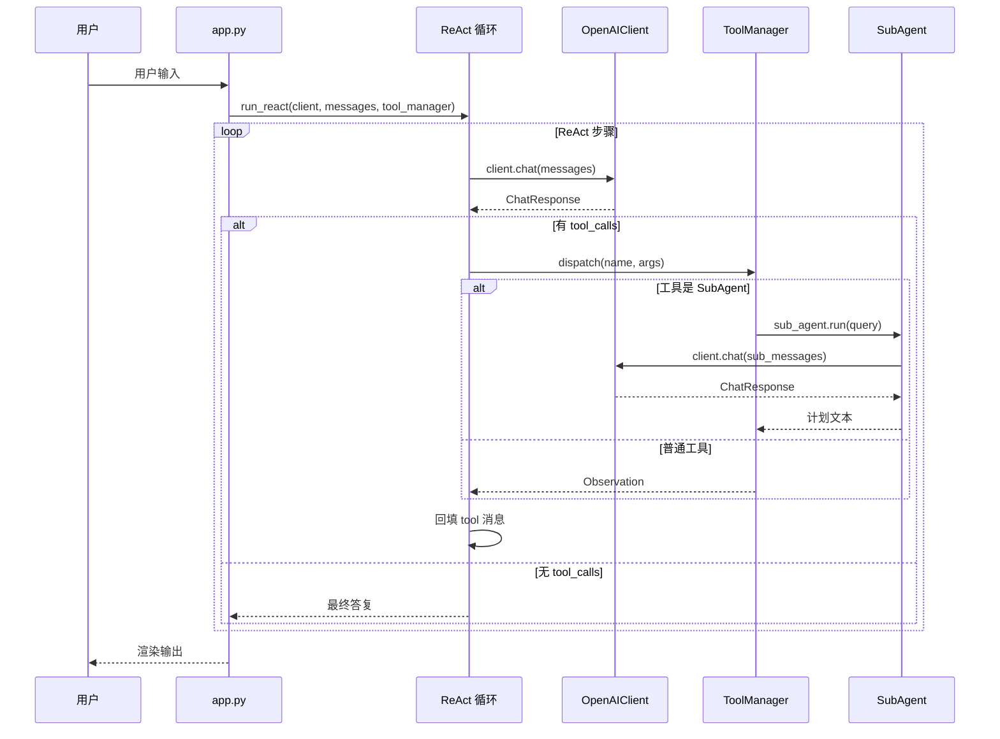

本篇聚焦于 ToyCoder 的 `agent/` 模块——Agent 系统的核心运行引擎。如果把 `client/` 比作通信层、`tool/` 比作能力层，那么 `agent/` 就是控制层——它决定了 Agent "如何思考和行动"。

## 模块结构

```
toycoder/agent/
├── react.py            # ReAct 循环引擎
├── sub_agent.py        # SubAgent 封装
└── sub_agent_tool.py   # SubAgent → Tool 适配器
```

三个文件，职责清晰：`react.py` 提供通用的 ReAct 循环算法，`sub_agent.py` 封装独立的子 Agent，`sub_agent_tool.py` 将 SubAgent 适配为工具接口。

## ReAct 循环

ReAct（Reasoning + Acting）循环是 Agent 的核心算法。在[基础篇 3](/posts/agent-dev-basis-3)中，笔者已经介绍了 ReAct 的基本原理。ToyCoder 提供了两个版本：`run_react`（非流式）和 `stream_react`（流式）。

### 非流式版本

```python
def run_react(
    client: BaseClient,
    messages: list[dict[str, Any]],
    tool_manager: ToolManager,
    max_steps: int = 16,
    on_tool_call: Callable[[str, dict], None] | None = None,
    on_tool_result: Callable[[str, str], None] | None = None,
) -> str:
```

函数签名的设计值得逐一讨论：

- **`client: BaseClient`** — 依赖抽象而非具体实现。ReAct 循环不关心底层用的是 OpenAI 还是其他服务商。
- **`messages: list[dict[str, Any]]`** — 对话历史。这是一个**可变列表**，函数会直接往里面追加消息。这个设计是有意的——调用方（通常是 `app.py`）维护 `messages` 列表，ReAct 循环负责往里面追加 assistant 消息和 tool 消息，循环结束后调用方可以直接使用更新后的 `messages` 进行下一轮对话。
- **`max_steps: int = 16`** — 安全阀。防止 Agent 陷入无限循环。16 步在实践中足以完成大多数任务。
- **`on_tool_call` / `on_tool_result`** — UI 回调。ReAct 循环本身不做任何 UI 渲染，而是通过回调通知外部。这种依赖注入的设计使得 ReAct 循环可以在任何环境中运行——TUI、Web 界面或单元测试。

核心循环逻辑：

```python
for step in range(max_steps):
    resp: ChatResponse = client.chat(messages, **kwargs)

    # 回填 assistant 消息
    assistant_msg: dict[str, Any] = {
        "role": "assistant",
        "content": resp.content,
    }
    if resp.tool_calls:
        assistant_msg["tool_calls"] = [
            {
                "id": tc.id,
                "type": "function",
                "function": {"name": tc.name, "arguments": tc.arguments},
            }
            for tc in resp.tool_calls
        ]
    messages.append(assistant_msg)

    # 没有工具调用 → 最终答复
    if not resp.tool_calls:
        return resp.content

    # 有工具调用 → 执行工具，回填 Observation
    for tc in resp.tool_calls:
        args = json.loads(tc.arguments) if isinstance(tc.arguments, str) else tc.arguments

        if on_tool_call:
            on_tool_call(tc.name, args)

        try:
            observation = tool_manager.dispatch(tc.name, args)
        except Exception as e:
            observation = f"[工具执行错误] {e}"

        observation_str = (
            json.dumps(observation, ensure_ascii=False, default=str)
            if not isinstance(observation, str)
            else observation
        )

        if on_tool_result:
            on_tool_result(tc.name, observation_str)

        messages.append({
            "role": "tool",
            "tool_call_id": tc.id,
            "content": observation_str,
        })
```

循环的每一步做三件事：

1. **调用 LLM**（Thought）。将当前的 `messages` 发送给 LLM，获取响应。
2. **回填 assistant 消息**。将 LLM 的响应（包括文本和工具调用请求）追加到 `messages` 中。
3. **判断是否结束**。如果没有工具调用请求，说明 LLM 已经给出了最终答复，循环结束。否则依次执行每个工具调用（Action），将结果作为 Observation 回填到 `messages` 中，然后进入下一轮循环。

这里有几个实现细节值得关注：

**assistant 消息的回填格式**。`tool_calls` 字段需要严格遵循 OpenAI API 的格式——每个工具调用包含 `id`、`type: "function"` 和 `function` 对象。这不是可选的装饰，而是 API 规范的要求：后续的 `tool` 角色消息必须通过 `tool_call_id` 与 assistant 消息中的工具调用对齐。

**错误处理**。工具执行失败时，异常信息被转换为 Observation 字符串回填给 LLM，而不是让异常向上传播。这让 LLM 能看到错误信息并尝试修复（如参数格式不对时调整参数重试），而不是让整个 Agent 崩溃。

**Observation 的序列化**。如果工具返回的是非字符串结果（如字典或列表），使用 `json.dumps` 序列化为 JSON 字符串。`ensure_ascii=False` 保留中文，`default=str` 处理不可序列化的对象（如 `Path` 对象）。

**超步数保护**。如果循环达到 `max_steps` 仍未结束，返回一条警告消息。这是一个重要的安全机制——没有它，一个持续请求工具调用的 LLM 会导致无限循环。

### 流式版本

`stream_react` 是 `run_react` 的流式变体，整体结构相同，但使用生成器逐步产出文本片段：

```python
def stream_react(
    client: BaseClient,
    messages: list[dict[str, Any]],
    tool_manager: ToolManager,
    max_steps: int = 16,
    on_tool_call: Callable[[str, dict], None] | None = None,
    on_tool_result: Callable[[str, str], None] | None = None,
) -> Generator[str, None, str]:
```

返回类型 `Generator[str, None, str]` 表示：`yield` 产出 `str`（文本片段），不接受 `send` 值（`None`），最终 `return` 一个 `str`（完整答复）。

关键差异在于 LLM 调用部分：

```python
for step in range(max_steps):
    full_content = ""
    for chunk in client.stream_chat(messages, **kwargs):
        full_content += chunk
        yield chunk

    resp = client.last_response
    if resp is None:
        return full_content

    # 后续的 assistant 回填和工具调用逻辑与非流式版本相同
    ...
```

流式版本通过 `yield chunk` 将 LLM 生成的每个文本片段实时传递给调用方（UI 层），实现了"边思考边显示"的效果。在文本流结束后，通过 `client.last_response` 获取完整的响应（包括工具调用信息），然后执行与非流式版本完全相同的工具调用和 Observation 回填逻辑。

注意工具调用阶段**不是流式的**——工具调用请求本身不产出可显示的文本。流式传输只发生在 LLM 生成文本答复时。当 LLM 返回工具调用而非文本时，用户看到的是 UI 层通过 `on_tool_call`/`on_tool_result` 回调渲染的工具执行状态，而不是流式文本。

### ReAct 为什么是无状态函数

值得注意的是，`run_react` 和 `stream_react` 都是**独立函数**，不是类方法。它们不维护任何内部状态——所有状态都通过参数传入（`messages`、`tool_manager`）或通过回调传出（`on_tool_call`、`on_tool_result`）。

这个设计选择是有意的：

1. **可测试性**。纯函数比有状态的类更容易测试——传入参数，检查返回值和 `messages` 的变化。
2. **可组合性**。SubAgent 可以直接调用 `run_react`，传入自己的 `client`、`messages` 和 `tool_manager`，不需要实例化一个 Agent 类。
3. **职责清晰**。ReAct 循环只负责"调用 LLM → 执行工具 → 回填结果"的算法逻辑，不关心消息从哪里来、结果往哪里去。

## SubAgent

SubAgent 代表一个拥有独立上下文和配置的子 Agent。在[进阶篇 2](/posts/agent-dev-advanced-2)中，笔者已经介绍了 SubAgent 的设计思路。ToyCoder 中的实现如下：

```python
@dataclass
class SubAgent:
    name: str
    client: BaseClient
    tool_manager: ToolManager
    prompt_manager: PromptManager
    prompt_name: str
    prompt_key: str
    max_steps: int = 8
```

每个 SubAgent 拥有：
- **独立的 `client`**。可以使用与主 Agent 不同的模型（如使用更便宜的模型做规划）。
- **独立的 `tool_manager`**。SubAgent 的工具集可以与主 Agent 不同——planner 不需要文件操作工具，reviewer 不需要 Shell 工具。
- **独立的 Prompt 配置**。通过 `prompt_name` 和 `prompt_key` 指定 SubAgent 使用的 Prompt 模板。

System Prompt 通过 `PromptManager` 延迟加载：

```python
@property
def system_prompt(self) -> str:
    return self.prompt_manager.get_system_prompt(self.prompt_name, self.prompt_key)

@property
def description(self) -> str:
    data = self.prompt_manager.load_prompt(self.prompt_name)
    return data.get(self.prompt_key, {}).get("description", self.name)
```

`description` 属性的设计值得注意——它从 Prompt 模板中提取描述文本。在 `agents.yaml` 中，每个 Agent 角色都有一个 `description` 字段：

```yaml
planner:
    description: 计划 Agent，负责将复杂任务分解为可执行的步骤
    system: |
        你是一个任务规划专家...
```

这个 `description` 最终会成为 SubAgent 被封装为工具后的工具描述，帮助主 Agent 理解何时应该调用这个 SubAgent。

### run 方法

```python
def run(self, user_input: str, context: str | None = None) -> str:
    from toycoder.agent.react import run_react

    system = self.system_prompt
    if context:
        system += f"\n\n## 上下文信息\n{context}"

    messages: list[dict[str, Any]] = [
        {"role": "system", "content": system},
        {"role": "user", "content": user_input},
    ]

    return run_react(
        client=self.client,
        messages=messages,
        tool_manager=self.tool_manager,
        max_steps=self.max_steps,
    )
```

`run` 方法的设计体现了 SubAgent 的核心特征——**独立的上下文**：

1. **全新的 `messages` 列表**。每次调用 `run` 都创建一个新的消息列表，不与主 Agent 共享上下文。SubAgent 不会看到主 Agent 的对话历史，这确保了它的判断不受之前对话的干扰。

2. **可选的 `context` 注入**。主 Agent 可以选择性地传入上下文信息（如当前正在操作的文件内容），这些信息会被追加到 System Prompt 末尾。这比把整个对话历史传给 SubAgent 更高效、更可控。

3. **延迟导入 `run_react`**。这是为了避免循环导入——`react.py` 和 `sub_agent.py` 之间存在间接的依赖关系（`run_react` 可能通过 `tool_manager` 调用 SubAgent，而 SubAgent 又调用 `run_react`）。

## SubAgent → Tool 适配器

`SubAgentTool` 将 SubAgent 封装为 `Tool` 接口，使得主 Agent 可以像调用普通工具一样调用 SubAgent：

```python
class SubAgentTool(Tool):
    def __init__(
        self,
        sub_agent: SubAgent,
        description: str | None = None,
        permission: PermissionLevel = PermissionLevel.SAFE,
    ) -> None:
        self.name = sub_agent.name
        self.description = description or sub_agent.description
        self.permission = permission
        self._sub_agent = sub_agent
        self.func = None
        self._params_model = create_model(
            f"{sub_agent.name}_Params",
            query=(
                Annotated[str, Field(description="发送给该 SubAgent 的任务描述或问题")],
                ...,
            ),
        )
```

`SubAgentTool` 与 `MCPTool`（见[实战篇 3](/posts/agent-dev-act-3)）采用了相同的适配策略——继承 `Tool` 但跳过父类的函数签名解析，直接提供自己的 Schema 和调用逻辑。

参数模型很简单——只有一个 `query` 字段，类型为字符串。主 Agent 调用 SubAgent 时，只需要传入一段自然语言描述：

```json
{
    "name": "planner",
    "arguments": {
        "query": "请为以下任务制定执行计划：重构 src/utils/ 目录下的所有工具函数"
    }
}
```

`invoke` 方法将工具调用转发给 SubAgent：

```python
def invoke(self, arguments: dict[str, Any]) -> Any:
    query = arguments.get("query", "")
    context = arguments.get("context", None)
    return self._sub_agent.run(query, context=context)
```

### 在 app.py 中的组装

在实际使用中，SubAgent 的创建和注册发生在 `app.py` 的初始化阶段：

```python
def _setup_plan_agent(self) -> None:
    plan_agent = SubAgent(
        name="planner",
        client=self.client,
        tool_manager=ToolManager(),  # planner 不需要工具
        prompt_manager=self.prompt_manager,
        prompt_name="agents",
        prompt_key="planner",
        max_steps=1,  # planner 一次输出即可
    )
    self.tool_manager.register(
        SubAgentTool(
            plan_agent,
            description="将复杂任务分解为清晰有序的执行步骤计划。",
        )
    )
```

几个设计决策：

1. **planner 使用空的 `ToolManager()`**。planner 的职责是制定计划，不需要执行任何操作，因此不注册任何工具。
2. **`max_steps=1`**。planner 的任务是一次性输出完整的计划，不需要多步循环。设为 1 可以避免 planner 陷入不必要的循环。
3. **planner 与主 Agent 共享 `client`**。在 ToyCoder 中，SubAgent 使用与主 Agent 相同的 LLM 模型。但这个设计是灵活的——如果需要，可以为 SubAgent 创建独立的 Client，使用不同的模型。
4. **自定义 `description`**。覆盖了从 `agents.yaml` 中读取的默认描述，提供了更精确的工具描述，帮助主 Agent 判断何时应该调用 planner。

## 整体工作流

将 `client/`、`tool/`、`agent/` 三个模块组合起来，一次完整的 Agent 交互流程如下：



这个流程中，ReAct 循环充当了"调度器"的角色——它不断地与 LLM 交互，根据 LLM 的决策调用工具，再将工具结果反馈给 LLM，直到 LLM 认为任务完成（不再请求工具调用）。

当 LLM 选择调用 planner 工具时，控制流会进入 SubAgent 的内部 ReAct 循环。SubAgent 有自己独立的 `messages` 和 System Prompt，在自己的上下文中完成任务后将结果返回给主 Agent 的 ReAct 循环。这种"循环中的循环"结构使得复杂任务可以被分层处理。

## 小结

`agent/` 模块虽然只有三个文件、不到 200 行代码，但实现了 Agent 系统最核心的能力：

1. **ReAct 循环**作为无状态函数实现，通过参数接收依赖、通过回调传递事件，可在任何上下文中复用。
2. **SubAgent** 通过独立的上下文和配置实现了职责分离，不同的 SubAgent 可以有不同的能力和行为。
3. **SubAgentTool** 通过适配器模式将 SubAgent 伪装为工具，使得主 Agent 可以用统一的方式调用所有能力——无论是读文件、搜索代码还是制定计划。

这三个组件的组合关系是：`run_react` 是引擎，`SubAgent` 是引擎的"子实例"，`SubAgentTool` 是连接主引擎和子引擎的桥梁。

下一篇将介绍 `session/` 和 `prompt/` 模块——会话管理与 Prompt 模板系统的实现。
