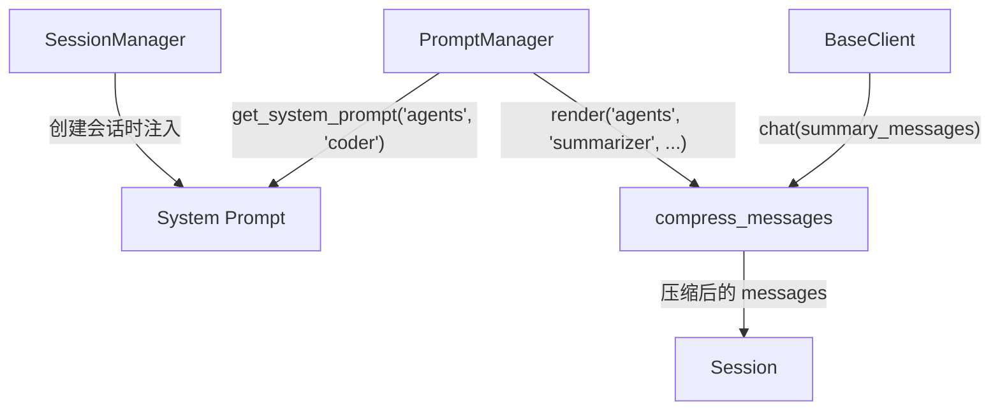

本篇聚焦于 ToyCoder 的 `session/` 和 `prompt/` 模块。这两个模块分别管理对话的"状态"和"指令"——`session/` 负责维护对话历史并在上下文过长时进行管理，`prompt/` 负责将 Agent 的角色定义和行为指令从代码中解耦出来，以 YAML 文件的形式统一管理。

## Prompt 管理模块

### 模块结构

```
toycoder/prompt/
├── manager.py          # PromptManager
└── templates/
    └── agents.yaml     # Agent 角色定义
```

### 设计动机

在[基础篇 4](/posts/agent-dev-basis-4)中，笔者介绍了将 Prompt 从代码中分离出来的重要性。ToyCoder 的 `PromptManager` 实现了这一理念——所有 Agent 角色的 System Prompt、User Prompt 模板和描述信息都定义在 YAML 文件中，代码通过 `PromptManager` 按需加载。

### PromptManager 实现

```python
class PromptManager:
    def __init__(self, template_dir: str | Path | None = None) -> None:
        self._template_dir = Path(template_dir) if template_dir else _TEMPLATE_DIR
        self._cache: dict[str, dict[str, Any]] = {}
```

构造函数接受一个可选的模板目录路径。如果不指定，默认使用 `prompt/templates/` 目录。`_cache` 字典用于缓存已加载的模板文件，避免重复的文件 I/O。

**加载模板**：

```python
def load_prompt(self, name: str) -> dict[str, Any]:
    if name in self._cache:
        return self._cache[name]

    prompt_path = self._template_dir / f"{name}.yaml"
    if not prompt_path.exists():
        raise FileNotFoundError(f"Prompt 模板文件未找到: {prompt_path}")

    with open(prompt_path, "r", encoding="utf-8") as f:
        prompt_data = yaml.safe_load(f)

    self._cache[name] = prompt_data
    return prompt_data
```

`load_prompt` 是最基础的方法——加载一个 YAML 文件并返回解析后的字典。缓存机制确保同一个文件只读取一次。`name` 参数支持路径形式（如 `agents`），对应 `templates/agents.yaml` 文件。

**渲染为消息列表**：

```python
def render(self, name: str, key: str, **variables: str) -> list[dict[str, str]]:
    data = self.load_prompt(name)
    if key not in data:
        raise KeyError(f"Prompt 模板 '{name}' 中未找到键 '{key}'")

    prompt = data[key]
    messages: list[dict[str, str]] = []

    if "system" in prompt:
        system_content = prompt["system"]
        if variables:
            system_content = system_content.format(**variables)
        messages.append({"role": "system", "content": system_content})

    if "user" in prompt:
        user_content = prompt["user"]
        if variables:
            user_content = user_content.format(**variables)
        messages.append({"role": "user", "content": user_content})

    return messages
```

`render` 方法是 `load_prompt` 的上层封装——它不仅加载模板，还将模板变量替换为实际值，并组装为 OpenAI 格式的消息列表。

例如，渲染 `summarizer` 的 Prompt：

```python
messages = prompt_manager.render(
    "agents", "summarizer",
    conversation="user: 帮我重构这个函数\nassistant: 好的，我来看看..."
)
# 结果：
# [
#   {"role": "system", "content": "你是一个文本摘要助手。"},
#   {"role": "user", "content": "请将以下对话历史总结为...对话历史：\nuser: 帮我重构..."}
# ]
```

**获取 System Prompt**：

```python
def get_system_prompt(self, name: str, key: str, **variables: str) -> str:
    data = self.load_prompt(name)
    if key not in data:
        raise KeyError(f"Prompt 模板 '{name}' 中未找到键 '{key}'")
    text = data[key].get("system", "")
    if variables:
        text = text.format(**variables)
    return text
```

`get_system_prompt` 是一个便捷方法——当只需要 System Prompt 的文本（而不是完整的消息列表）时使用。SubAgent 在初始化时就用这个方法加载自己的 System Prompt。

### Prompt 模板设计

`agents.yaml` 定义了 ToyCoder 中所有 Agent 角色的 Prompt：

```yaml
coder:
    description: 主编码 Agent，负责理解用户需求并使用工具完成编码任务
    system: |
        你是 ToyCoder，一个专业的编程助手。你可以通过调用工具来读取文件、
        编写代码、执行命令和搜索代码库，帮助用户完成各种编程任务。

        ## 工作原则
        1. 对于复杂任务，先调用 planner 工具制定计划，再按步骤执行。
        2. 在修改代码之前，先阅读相关文件以理解上下文。
        ...

planner:
    description: 计划 Agent，负责将复杂任务分解为可执行的步骤
    system: |
        你是一个任务规划专家。...
    user: |
        请为以下任务制定执行计划：

        {task}

summarizer:
    description: 上下文压缩 Agent，将长对话历史压缩为摘要
    system: |
        你是一个文本摘要助手。
    user: |
        请将以下对话历史总结为一段简洁的摘要...

        对话历史：
        {conversation}
```

模板的结构有几个设计要点：

1. **每个 Agent 角色是一个顶层键**。`coder`、`planner`、`summarizer` 分别对应不同的 Agent 角色。
2. **`description` 字段**提供角色的简短描述，被 `SubAgent.description` 属性读取，最终成为 SubAgent 工具的描述文本。
3. **`system` 字段**定义 System Prompt。这是 Agent 行为的核心指令。
4. **`user` 字段**（可选）定义 User Prompt 模板，包含 `{placeholder}` 变量。`render` 方法会用实际值替换这些占位符。
5. **YAML 的 `|` 语法**保留了多行文本的换行符，使得 Prompt 的编写和阅读都很自然。

`coder` 角色的 System Prompt 中值得注意"工作原则"部分——它指导 LLM 何时调用 planner、何时先阅读文件、何时使用搜索工具。这些原则不是可有可无的建议，而是影响 Agent 行为质量的关键指令。

## 会话管理模块

### 模块结构

```
toycoder/session/
└── manager.py    # Session + SessionManager + 上下文管理策略
```

所有会话相关的代码都在一个文件中——`Session` 数据类、`SessionManager` 管理器、以及 `truncate_messages` 和 `compress_messages` 两个上下文管理函数。

### Session 数据类

```python
@dataclass
class Session:
    session_id: str
    messages: list[dict[str, Any]] = field(default_factory=list)
    metadata: dict[str, Any] = field(default_factory=dict)

    def add_message(self, role: str, content: str, **kwargs: Any) -> None:
        msg: dict[str, Any] = {"role": role, "content": content}
        msg.update(kwargs)
        self.messages.append(msg)

    def to_dict(self) -> dict[str, Any]:
        return {
            "session_id": self.session_id,
            "messages": self.messages,
            "metadata": self.metadata,
        }

    @classmethod
    def from_dict(cls, data: dict[str, Any]) -> "Session":
        return cls(
            session_id=data["session_id"],
            messages=data.get("messages", []),
            metadata=data.get("metadata", {}),
        )
```

`Session` 的设计刻意保持简单——它只是一个数据容器，不包含任何业务逻辑。`to_dict` / `from_dict` 方法提供序列化/反序列化能力，用于持久化到 JSON 文件。

`metadata` 字典是一个灵活的扩展点——可以存储会话的创建时间、最后活跃时间、会话标题等元信息。当前 ToyCoder 没有大量使用 metadata，但这个字段为未来的功能扩展预留了空间。

### SessionManager

`SessionManager` 负责管理多个 `Session` 实例的生命周期：

```python
class SessionManager:
    def __init__(
        self,
        system_prompt: str = "",
        storage_dir: str | Path | None = None,
    ) -> None:
        self._sessions: dict[str, Session] = {}
        self._system_prompt = system_prompt
        self._storage_dir: Path | None = None

        if storage_dir is not None:
            self._storage_dir = Path(storage_dir)
            self._storage_dir.mkdir(parents=True, exist_ok=True)
            self._load_all()
```

构造函数的两个参数体现了两个重要功能：

1. **`system_prompt`** — 新创建的会话会自动注入 System Prompt 作为第一条消息。这确保了每个会话都有一致的 Agent 角色定义。
2. **`storage_dir`** — 可选的持久化目录。传入后，会话会自动保存到该目录下的 JSON 文件中，启动时也会自动加载已有会话。

### 持久化机制

持久化的实现遵循"简单即可靠"的原则：

```python
def _save_session(self, session: Session) -> None:
    path = self._session_path(session.session_id)
    if path is None:
        return
    try:
        path.write_text(
            json.dumps(session.to_dict(), ensure_ascii=False, indent=2),
            encoding="utf-8",
        )
    except Exception:
        pass  # 静默失败

def _load_all(self) -> None:
    if self._storage_dir is None:
        return
    for path in self._storage_dir.glob("*.json"):
        try:
            data = json.loads(path.read_text(encoding="utf-8"))
            session = Session.from_dict(data)
            self._sessions[session.session_id] = session
        except Exception:
            continue
```

每个会话保存为一个独立的 JSON 文件，文件名就是 `session_id.json`。这种**一会话一文件**的设计比用单个数据库文件更简单、更安全——单个文件损坏不会影响其他会话，调试时也可以直接查看 JSON 内容。

持久化的异常处理策略是**静默失败**——无论是保存还是加载，如果出错就跳过，不中断主流程。这是一个务实的选择：持久化是锦上添花的功能，如果因为文件权限或磁盘空间问题导致保存失败，Agent 的核心对话功能不应该受影响。

### 会话生命周期管理

```python
def create_session(self, session_id: str | None = None, **metadata) -> Session:
    sid = session_id or str(uuid.uuid4())[:8]
    session = Session(session_id=sid, metadata=metadata)
    if self._system_prompt:
        session.add_message("system", self._system_prompt)
    self._sessions[sid] = session
    self._save_session(session)
    return session

def get_or_create(self, session_id: str, **metadata) -> Session:
    if session_id not in self._sessions:
        return self.create_session(session_id, **metadata)
    return self._sessions[session_id]

def delete_session(self, session_id: str) -> None:
    self._sessions.pop(session_id, None)
    self._delete_session_file(session_id)
```

`create_session` 在创建新会话时自动注入 System Prompt——这是关键的一步，确保了 Agent 在新会话中拥有正确的角色定义。如果不指定 `session_id`，使用 UUID 的前 8 位作为会话 ID（简短但足够唯一）。

### 上下文截断

当对话历史过长时，最简单的处理方式是截断——保留 System Prompt 和最近的 N 轮对话：

```python
def truncate_messages(
    messages: list[dict[str, Any]],
    max_turns: int = 20,
) -> list[dict[str, Any]]:
    system_msgs = [m for m in messages if m["role"] == "system"]
    non_system = [m for m in messages if m["role"] != "system"]

    if len(non_system) <= max_turns * 2:
        return messages

    truncated = non_system[-(max_turns * 2):]

    # 确保截断点不在 tool_calls 序列中间
    while truncated and truncated[0]["role"] == "tool":
        truncated.pop(0)

    return system_msgs + truncated
```

这段代码中最微妙的部分是最后的 `while` 循环——它确保截断点不会落在一组 `tool_calls` 和对应的 `tool` 消息中间。

为什么这很重要？考虑以下消息序列：

```
assistant: (tool_calls: [read_file, grep_search])  ← step 5
tool: (read_file 的结果)                           ← step 5 的 observation
tool: (grep_search 的结果)                         ← step 5 的 observation
assistant: 根据搜索结果，我建议...                    ← step 6
```

如果截断点恰好落在第一条 `tool` 消息之前，截断后的序列会以 `tool` 消息开头，但缺少了对应的 `assistant` 消息（包含 `tool_calls`），这会导致 LLM API 报错——因为 `tool` 消息必须有对应的 `tool_call_id`。

`while truncated[0]["role"] == "tool"` 会持续弹出开头的 `tool` 消息，直到序列以非 `tool` 消息开头，从而避免了这个问题。

### 上下文压缩

压缩是比截断更智能的策略——通过 LLM 将早期对话总结为摘要，保留关键信息的同时减少消息数量：

```python
def compress_messages(
    client: BaseClient,
    prompt_manager: PromptManager,
    messages: list[dict[str, Any]],
    keep_recent: int = 6,
) -> list[dict[str, Any]]:
    system_msgs = [m for m in messages if m["role"] == "system"]
    non_system = [m for m in messages if m["role"] != "system"]

    if len(non_system) <= keep_recent:
        return messages

    # 格式化需要压缩的早期消息
    to_compress = non_system[:-keep_recent]
    conversation_text = "\n".join(
        f'{m["role"]}: {m["content"]}'
        for m in to_compress
        if m["role"] in ("user", "assistant") and m.get("content")
    )

    if not conversation_text.strip():
        return truncate_messages(messages, max_turns=keep_recent // 2)

    # 通过 PromptManager 加载摘要 Prompt
    summary_messages = prompt_manager.render(
        "agents", "summarizer", conversation=conversation_text
    )

    try:
        summary_resp = client.chat(summary_messages)
        summary_text = summary_resp.content
    except Exception:
        return truncate_messages(messages, max_turns=keep_recent // 2)

    summary_msg = {
        "role": "user",
        "content": (
            f"[以下是之前对话的摘要]\n{summary_text}\n"
            f"[摘要结束，以下是最近的对话]"
        ),
    }

    recent = non_system[-keep_recent:]
    return system_msgs + [summary_msg] + recent
```

压缩的流程如下：

1. **分离消息**。将 System Prompt 和非 System 消息分开处理。
2. **确定压缩范围**。保留最近的 `keep_recent` 条消息，对之前的消息进行压缩。
3. **格式化待压缩内容**。只提取 `user` 和 `assistant` 角色的文本内容，跳过 `tool` 消息（工具调用的细节通常不需要保留在摘要中）。
4. **调用 LLM 生成摘要**。使用 `summarizer` 的 Prompt 模板，将对话历史传入 LLM 进行总结。
5. **组装压缩后的消息**。System Prompt + 摘要消息 + 最近的消息。

几个关键设计决策：

**摘要以 `user` 角色插入**。摘要消息使用 `role: "user"` 而非自定义角色，这确保了与所有 LLM API 的兼容性。方括号包裹的标记（`[以下是之前对话的摘要]`）帮助 LLM 理解这不是用户的新输入，而是之前对话的总结。

**压缩失败时退化为截断**。如果 LLM 调用失败（网络错误、API 限制等），不会让应用崩溃，而是退化为简单的截断策略。这种"优雅降级"确保了应用的健壮性。

**空内容检查**。如果需要压缩的消息中没有有效文本（全是 tool 消息），直接退化为截断，避免发送空的对话历史给 LLM。

### 在 app.py 中的使用

上下文管理在 `ToyCoderApp.chat()` 中、用户消息追加之前被调用：

```python
def _manage_context(self, session: Session) -> None:
    max_msgs = self.config.session.max_messages
    keep_recent = self.config.session.compress_keep_recent

    if len(session.messages) > max_msgs:
        print_info("上下文较长，正在压缩历史对话...")
        try:
            session.messages = compress_messages(
                self.client, self.prompt_manager,
                session.messages, keep_recent=keep_recent,
            )
            print_info("上下文压缩完成。")
        except Exception:
            session.messages = truncate_messages(
                session.messages, max_turns=keep_recent
            )
            print_warning("上下文压缩失败，已截断历史消息。")
```

注意上下文管理的时机——在添加新的用户消息**之前**执行。这确保了新消息不会因为上下文管理而被压缩或截断掉。

触发条件是消息数量超过 `max_messages`（默认 50）。策略是**压缩优先，截断兜底**——先尝试 LLM 压缩，如果压缩失败则退化为截断。这两级策略在[进阶篇 3](/posts/agent-dev-advanced-3)中已经讨论过其设计思路。

## 两个模块的协作

`prompt/` 和 `session/` 模块之间有一个重要的协作点——`compress_messages` 函数同时依赖 `BaseClient`（用于调用 LLM）和 `PromptManager`（用于加载摘要 Prompt 模板）。



在 `app.py` 的 `setup()` 中，这个协作关系是这样建立的：

```python
# PromptManager 加载 coder 的 System Prompt
system_prompt = self.prompt_manager.get_system_prompt("agents", "coder")

# System Prompt 注入 SessionManager，新会话自动使用
self.session_manager = SessionManager(
    system_prompt=system_prompt,
    storage_dir=_DATA_DIR,
)
```

SessionManager 拿到的是一个**已渲染的字符串**——它不关心这个字符串来自 YAML 文件还是硬编码，只管把它作为每个新会话的第一条消息。这种设计保持了两个模块之间的松耦合。

## 小结

`prompt/` 和 `session/` 模块虽然功能不同，但共同服务于一个目标：让 Agent 的对话保持高质量。

- **PromptManager** 确保 Agent 拥有清晰、一致的行为指令，并且这些指令可以在不修改代码的情况下调整。
- **SessionManager** 确保对话历史被正确维护、持久化，并在上下文过长时进行智能管理。
- **上下文管理**（截断和压缩）确保 LLM 始终在合理的上下文窗口内工作，避免了因上下文过长导致的性能下降或 API 限制。

下一篇将介绍 ToyCoder 的应用层——`config.py`、`command/`、`ui/` 和 `app.py`，看看所有模块是如何被组装成一个完整的应用的。
