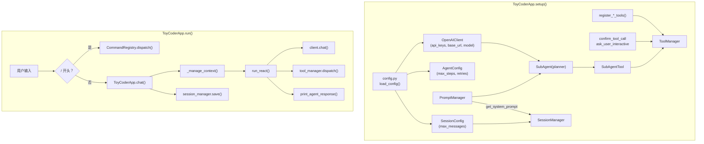

本篇是实战系列的最后一篇，聚焦于 ToyCoder 的应用层——`config.py`、`command/`、`ui/` 和 `app.py`。前面几篇文章分别介绍了 LLM 客户端、工具系统、Agent 核心、会话管理和 Prompt 管理等模块，本篇要看的是这些模块如何被组装成一个可运行的完整应用。

## 配置模块

### Dataclass 配置结构

`config.py` 使用 `dataclass` 定义了类型安全的配置结构：

```python
@dataclass
class ProviderConfig:
    api_keys: list[str]
    base_url: str
    models: dict[str, str]

@dataclass
class AgentConfig:
    max_steps: int = 16
    max_retries: int = 2
    retry_interval: float = 1.0

@dataclass
class SessionConfig:
    max_messages: int = 50
    compress_keep_recent: int = 8

@dataclass
class MCPServerConfig:
    command: str
    args: list[str] = field(default_factory=list)
    env: dict[str, str] = field(default_factory=dict)

@dataclass
class AppConfig:
    providers: dict[str, ProviderConfig]
    default_provider: str
    agent: AgentConfig
    session: SessionConfig
    mcp_servers: dict[str, MCPServerConfig]
```

为什么用 `dataclass` 而不是普通字典？

1. **类型安全**。`config.agent.max_steps` 在 IDE 中有类型提示，拼写错误会被检测出来。用字典的话，`config["agent"]["max_stepss"]`（多了一个 s）只会在运行时抛出 `KeyError`。
2. **默认值**。`AgentConfig` 和 `SessionConfig` 的每个字段都有合理的默认值，用户只需要配置 `providers` 段即可使用。
3. **结构文档化**。`dataclass` 的字段定义本身就是配置结构的文档，新开发者看一眼就知道有哪些可配置项。

### 配置加载

```python
def load_config(config_path: str | Path | None = None) -> AppConfig:
    if config_path is None:
        candidates = [
            Path.cwd() / "config.yaml",
            Path(__file__).parent.parent / "config.yaml",
        ]
        for p in candidates:
            if p.exists():
                config_path = p
                break
        else:
            raise FileNotFoundError("未找到 config.yaml")

    path = Path(config_path)
    with open(path, "r", encoding="utf-8") as f:
        raw: dict[str, Any] = yaml.safe_load(f)

    # 逐段解析为 dataclass
    providers = {}
    for name, cfg in raw.get("providers", {}).items():
        providers[name] = ProviderConfig(
            api_keys=cfg.get("api_keys", []),
            base_url=cfg.get("base_url", "https://api.openai.com/v1"),
            models=cfg.get("models", {"default": "gpt-4o"}),
        )
    # ... 解析 agent, session, mcp_servers ...

    return AppConfig(
        providers=providers,
        default_provider=raw.get("default_provider", "openai"),
        agent=agent_cfg,
        session=session_cfg,
        mcp_servers=mcp_servers,
    )
```

配置文件的查找策略是**就近优先**：先在当前工作目录查找 `config.yaml`，再到项目根目录查找。这使得用户可以在不同项目目录下使用不同的配置（如不同的 API Key 或模型）。

解析过程使用了**防御性编程**——每个字段都有 `.get(key, default)` 的默认值，缺失的配置项不会导致崩溃。

## 斜杠命令系统

### CommandRegistry

`command/base.py` 实现了斜杠命令的注册和派发机制，设计上与 `ToolManager` 非常相似：

```python
CommandHandler = Callable[[Any, list[str]], bool]

@dataclass
class Command:
    name: str
    handler: CommandHandler
    help_text: str = ""
    usage: str = ""
    aliases: list[str] = field(default_factory=list)
    hidden: bool = False

class CommandRegistry:
    def __init__(self) -> None:
        self._commands: dict[str, Command] = {}
        self._aliases: dict[str, str] = {}
```

`CommandHandler` 的签名是 `(app, args) -> bool`：
- `app` 是 `ToyCoderApp` 实例，通过它可以访问应用的所有状态。
- `args` 是命令参数列表（如 `/tool enable run_command` 中的 `["enable", "run_command"]`）。
- 返回 `True` 表示继续主循环，`False` 表示退出程序。

`aliases` 支持命令别名，如 `/quit` 的别名包括 `/exit` 和 `/q`。`hidden` 标记隐藏命令，不出现在 `/help` 列表中。

**注册与派发**：

```python
def register(self, cmd: Command) -> None:
    self._commands[cmd.name] = cmd
    for alias in cmd.aliases:
        self._aliases[alias] = cmd.name

def dispatch(self, app: Any, raw_input: str) -> bool:
    parts = raw_input.strip().split()
    cmd_name = parts[0].lower()
    args = parts[1:]

    cmd = self.get(cmd_name)
    if cmd is None:
        print_error(f"未知命令: {cmd_name}，输入 /help 查看可用命令。")
        return True

    return cmd.handler(app, args)
```

`dispatch` 的返回值直接决定主循环是否继续——当 `/quit` 命令返回 `False` 时，主循环退出。

**装饰器注册**：

```python
def command(self, name, *, help_text="", usage="", aliases=None, hidden=False):
    def decorator(func):
        cmd = Command(
            name=name, handler=func,
            help_text=help_text, usage=usage,
            aliases=aliases or [], hidden=hidden,
        )
        self.register(cmd)
        return func
    return decorator
```

装饰器的用法简洁直观：

```python
@registry.command("new", help_text="新建会话")
def cmd_new(app, args):
    ...
    return True
```

**自动生成帮助文本**：

```python
def generate_help(self) -> str:
    lines = ["[bold]可用命令：[/bold]\n"]
    for cmd in self._commands.values():
        if cmd.hidden:
            continue
        display_name = f"/{cmd.name}"
        if cmd.usage:
            display_name += f" {cmd.usage}"
        padded = f"  {display_name:<25s}"
        lines.append(f"{padded}{cmd.help_text}")
    return "\n".join(lines)
```

帮助文本是从注册的命令列表中自动生成的——新增命令时不需要手动更新帮助文档。

### 内置命令

`command/builtin.py` 通过 `register_builtin_commands` 函数批量注册所有内置命令。挑几个有代表性的来看：

**`/new` — 新建会话**：

```python
@registry.command("new", help_text="新建会话（清除当前对话历史）")
def cmd_new(app, args):
    new_id = str(uuid.uuid4())[:8]
    app.session_manager.create_session(new_id)
    app.current_session_id = new_id
    app.tool_manager.reset_approvals()
    print_info(f"已创建新会话: {new_id}")
    return True
```

注意 `reset_approvals()` 的调用——切换到新会话时，之前授予 SENSITIVE 工具的"始终允许"权限会被清除。这是一个安全设计，确保权限不会跨会话泄露。

**`/tool` — 工具管理**：

```python
@registry.command("tool", usage="enable|disable <name>",
                   help_text="启用或禁用指定工具")
def cmd_tool(app, args):
    if len(args) < 2:
        print_error("用法: /tool enable|disable <tool_name>")
        return True

    action, name = args[0].lower(), args[1]

    if app.tool_manager.get_tool(name) is None:
        print_error(f"工具不存在: {name}")
        return True

    if action == "enable":
        app.tool_manager.enable_tool(name)
        print_info(f"已启用工具: {name}")
    elif action == "disable":
        app.tool_manager.disable_tool(name)
        print_info(f"已禁用工具: {name}")
    else:
        print_error(f"未知操作: {action}")
    return True
```

这个命令的主要用途是启用 DANGEROUS 工具（如 `run_command`）。命令的参数校验是防御性的——参数不足、工具不存在、操作未知都会给出明确的错误提示。

**`/tools` — 列出所有工具**：

```python
@registry.command("tools", help_text="列出已注册的工具及状态")
def cmd_tools(app, args):
    tools = app.tool_manager.list_tools()
    print_info(f"已注册 {len(tools)} 个工具:")
    for name in tools:
        tool = app.tool_manager.get_tool(name)
        enabled = app.tool_manager.is_enabled(name)
        icon = TOOL_ICONS.get(name, DEFAULT_TOOL_ICON)

        line = Text()
        if enabled:
            line.append("  ● ", style="green")
        else:
            line.append("  ○ ", style="red")
        line.append(f"{icon} ", style="cyan")
        line.append(f"{name:<18s}", style="magenta bold" if enabled else "dim")
        line.append(f" [{tool.permission.value:>9}] ", style="dim")
        line.append(tool.description[:45], style="dim")
        if name in app.tool_manager._auto_approved:
            line.append(" (auto)", style="dim italic")
        console.print(line)
    return True
```

`/tools` 命令使用 Rich 的 `Text` 对象来构建颜色丰富的输出——启用的工具用绿色圆点（●），禁用的用红色空心圆（○），每个工具的名称、权限等级、描述一目了然。这种精心设计的输出格式让用户在终端中就能快速了解工具的状态。

## TUI 界面模块

### 设计理念

`ui/display.py` 基于 [Rich](https://github.com/Textualize/rich) 库实现终端界面。ToyCoder 的 UI 设计风格参考了 [OpenCode](https://opencode.ai) 等现代终端工具——使用彩色竖线、图标和面板来区分不同类型的内容。

所有 UI 函数都设计为**无状态的纯函数**——它们不维护内部状态，只负责将数据渲染到终端。这意味着 UI 模块可以被替换（如换成 Web 界面），而不需要修改任何核心模块。

### 主题与图标

```python
THEME = Theme({
    "info": "cyan",
    "warning": "yellow",
    "error": "red bold",
    "tool.icon": "cyan",
    "tool.name": "magenta bold",
    "user.border": "cyan bold",
    "agent.label": "blue bold",
    # ...
})

console = Console(theme=THEME)

TOOL_ICONS = {
    "read_file": "⎉", "write_file": "⎉", "edit_file": "⎉",
    "grep_search": "⌕", "glob_search": "⌕",
    "run_command": "$",
    "ask_user": "?",
    "planner": "◈",
}
```

统一的主题定义和图标映射使得整个界面风格一致。每个工具都有对应的图标，在工具调用时显示在工具名前面，让用户一眼就能识别正在执行什么操作。

### 用户消息

```python
def print_user_message(content: str) -> None:
    lines = content.split("\n")
    label = Text()
    label.append("  │ ", style="user.border")
    label.append("You", style="user.label")
    console.print(label)

    for line in lines:
        row = Text()
        row.append("  │ ", style="user.border")
        row.append(line, style="user.text")
        console.print(row)
```

用户消息使用左侧青色竖线（│）标记，视觉效果类似于引用块。这种设计让用户消息在终端中有明确的视觉边界，不会与 Agent 回复混淆。

### 工具调用展示

工具调用有两种展示模式——短结果内联展示，长结果面板展示：

```python
def print_tool_call(name: str, arguments: dict) -> None:
    """单行展示工具调用。如：⎉ read_file src/main.py"""
    icon = TOOL_ICONS.get(name, DEFAULT_TOOL_ICON)
    summary = _compact_args(name, arguments)
    line = Text()
    line.append(f"  {icon} ", style="tool.icon")
    line.append(name, style="tool.name")
    if summary:
        line.append(f" {summary}", style="tool.arg")
    console.print(line)

def print_tool_result(name: str, result: str) -> None:
    """短结果内联，长结果面板。"""
    lines = result.split("\n")
    if len(result) <= 200 and len(lines) <= 3:
        # 内联展示
        for rline in lines:
            row = Text()
            row.append("    ", style="dim")
            row.append(rline, style="tool.result")
            console.print(row)
    else:
        # 面板展示（截断到 15 行）
        display_lines = lines[:15]
        display_text = "\n".join(display_lines)
        if len(lines) > 15:
            display_text += f"\n... ({len(lines)} lines total)"
        console.print(Panel(
            content, title=f"[dim]{icon} {name}[/dim]",
            border_style="tool.block.border",
        ))
```

`_compact_args` 函数将工具参数压缩为单行摘要——不同的工具显示不同的关键参数：

```python
TOOL_DISPLAY_ARGS = {
    "read_file": ["path"],
    "grep_search": ["pattern", "path"],
    "run_command": ["command"],
    # ...
}
```

这样 `read_file` 显示为 `⎉ read_file src/main.py`，`grep_search` 显示为 `⌕ grep_search TODO .`，简洁明了。

### Agent 回复

```python
def print_agent_response(content: str, model: str = "", duration: float = 0.0):
    if content.strip():
        md = Markdown(content)
        console.print(md, width=min(console.width - 4, 100))

    footer = Text()
    footer.append("  ▣ ", style="agent.dot")
    footer.append("ToyCoder", style="agent.footer")
    if model:
        footer.append(f" · {model}", style="agent.footer")
    if duration > 0:
        footer.append(f" · {duration:.1f}s", style="agent.footer")
    console.print(footer)
```

Agent 回复使用 Rich 的 `Markdown` 渲染器，支持代码块语法高亮、列表、标题等格式。底部的元信息行（模型名和耗时）以低对比度的灰色显示，提供有用信息但不分散注意力。

### 权限确认对话框

```python
def confirm_tool_call(name: str, description: str, arguments: dict) -> bool | str:
    content = Text()
    content.append("Agent 请求执行敏感操作\n\n", style="warning")
    content.append(f"  {icon} ", style="tool.icon")
    content.append(name, style="tool.name")
    if summary:
        content.append(f" {summary}", style="tool.arg")

    console.print(Panel(
        content,
        title="[warning]△ 权限确认[/warning]",
        border_style="yellow",
    ))
    response = console.input(
        "[bold]  允许执行？ [dim](y=允许 / a=始终允许 / n=拒绝)[/dim]: [/bold]"
    ).strip().lower()
    if response in ("a", "always"):
        return "always"
    if response in ("y", "yes"):
        return True
    return False
```

权限确认使用黄色边框的面板突出显示，与普通的工具调用有明显的视觉区别。三个选项（y/a/n）的设计在[进阶篇 4](/posts/agent-dev-advanced-4)中已经讨论过——"始终允许"选项避免了频繁确认的烦恼。

## 应用主类

`app.py` 中的 `ToyCoderApp` 是整个应用的组装点——它将配置、客户端、工具、Agent、会话、命令和 UI 组装在一起。

### 初始化流程

```python
class ToyCoderApp:
    def __init__(self, config_path: str | None = None) -> None:
        self.config = load_config(config_path)
        self.prompt_manager = PromptManager()
        self.tool_manager = ToolManager()
        self.client: OpenAIClient | None = None
        self.session_manager: SessionManager | None = None
        self.current_session_id: str = "default"
        self.command_registry = CommandRegistry()
```

构造函数只做最基本的初始化——加载配置、创建空的管理器。真正的组装工作由 `setup()` 方法完成：

```python
def setup(self) -> None:
    # 1. 创建 LLM Client
    provider = self.config.providers[provider_name]
    self.client = OpenAIClient(
        api_keys=provider.api_keys,
        base_url=provider.base_url,
        model=provider.models.get("default", "gpt-4o"),
        max_retries=self.config.agent.max_retries,
        retry_interval=self.config.agent.retry_interval,
    )

    # 2. 注册内置工具
    register_file_tools(self.tool_manager)
    register_search_tools(self.tool_manager)
    register_shell_tools(self.tool_manager)
    register_question_tools(self.tool_manager)

    # 3. 设置 UI 回调
    self.tool_manager.set_confirm_callback(confirm_tool_call)
    set_ask_user_callback(ask_user_interactive)

    # 4. 注册 Plan Agent 作为工具
    self._setup_plan_agent()

    # 5. 注册内置斜杠命令
    register_builtin_commands(self.command_registry)

    # 6. 初始化 Session 管理器
    system_prompt = self.prompt_manager.get_system_prompt("agents", "coder")
    self.session_manager = SessionManager(
        system_prompt=system_prompt,
        storage_dir=_DATA_DIR,
    )

    # 7. 创建或恢复默认会话
    if self.session_manager.get_session(self.current_session_id) is None:
        self.session_manager.create_session(self.current_session_id)
```

初始化顺序是精心设计的，每一步都依赖前面的步骤：

1. **Client 先行**——后续的 SubAgent 需要 Client。
2. **工具注册**——必须在 SubAgent 注册之前完成，因为 SubAgent 本身也是通过 `tool_manager.register` 注册的。
3. **UI 回调设置**——必须在 `ToolManager` 创建之后，因为回调通过 `tool_manager.set_confirm_callback` 注入。
4. **SubAgent 注册**——依赖 Client 和 ToolManager 的就绪。
5. **斜杠命令注册**——独立于其他模块，放在中间。
6. **SessionManager 初始化**——依赖 PromptManager 提供 System Prompt。
7. **默认会话创建**——依赖 SessionManager 的就绪。

### chat 方法

```python
def chat(self, user_input: str) -> None:
    session = self._get_session()

    # 上下文管理（在添加新消息之前）
    self._manage_context(session)

    # 展示用户消息
    print_user_message(user_input)

    # 添加用户消息
    session.add_message("user", user_input)

    # 执行 ReAct 循环
    t0 = time.monotonic()
    try:
        response = run_react(
            client=self.client,
            messages=session.messages,
            tool_manager=self.tool_manager,
            max_steps=self.config.agent.max_steps,
            on_tool_call=print_tool_call,
            on_tool_result=print_tool_result,
        )
        duration = time.monotonic() - t0
        print_agent_response(response, model=self.model_name, duration=duration)
    except KeyboardInterrupt:
        print_warning("已中断当前操作。")
        # 回滚未完成的消息
        while session.messages and session.messages[-1]["role"] != "user":
            session.messages.pop()
    except Exception as e:
        print_error(f"Agent 执行失败: {e}")

    # 保存会话
    self.session_manager.save(self.current_session_id)
```

`chat` 方法是一次完整用户交互的入口。几个值得注意的设计：

**`KeyboardInterrupt` 的处理**。当用户按 Ctrl+C 中断 Agent 时，需要回滚消息历史——将 ReAct 循环中已经追加的不完整消息（如只有 `tool_calls` 但缺少对应 `tool` 结果的 assistant 消息）从 `messages` 中移除。`while` 循环从尾部弹出消息直到遇到用户的原始输入，确保消息历史处于一致状态。

**耗时统计**。`time.monotonic()` 用于精确计时——它不受系统时钟调整的影响，比 `time.time()` 更适合测量执行时长。

**每次对话后保存**。无论对话成功还是失败，都在最后保存会话，确保不丢失任何对话内容。

### 主循环

```python
def run(self) -> None:
    print_welcome()

    try:
        self.setup()
    except FileNotFoundError as e:
        print_error(str(e))
        print_info("请复制 config.yaml 到当前目录并填写 API Key。")
        sys.exit(1)
    except Exception as e:
        print_error(f"初始化失败: {e}")
        sys.exit(1)

    # 显示状态栏和警告
    print_status_bar(
        provider=self.config.default_provider,
        model=self.model_name,
        session_id=self.current_session_id,
        enabled=len(self.tool_manager.list_enabled()),
        disabled=len(self.tool_manager.list_disabled()),
    )

    if self.tool_manager.list_disabled():
        disabled = self.tool_manager.list_disabled()
        print_warning(
            f"以下工具默认禁用 (DANGEROUS): {', '.join(disabled)}"
        )

    # 主循环
    while True:
        user_input = get_user_input()

        if user_input is None:  # EOF 或 Ctrl+C
            self.session_manager.save_all()
            print_info("再见！")
            break

        user_input = user_input.strip()
        if not user_input:
            continue

        if user_input.startswith("/"):
            if not self.command_registry.dispatch(self, user_input):
                break
            continue

        self.chat(user_input)
```

主循环的结构清晰明了：

1. **获取输入**。`get_user_input()` 返回 `None` 表示退出（EOF 或 Ctrl+C）。
2. **跳过空输入**。避免空字符串进入 Agent 对话。
3. **路由判断**。以 `/` 开头的输入路由到 `CommandRegistry`，其他输入进入 `chat()` 方法。
4. **命令返回值**。`dispatch` 返回 `False` 时（如 `/quit` 命令）跳出循环。

这就是 ToyCoder 的完整控制流——从用户输入到命令派发或 Agent 对话，再到结果渲染和会话保存。

## 模块组装全景图

最后，笔者用一张图来展示所有模块在 `app.py` 中的组装关系：



从这张图中可以看到，`ToyCoderApp` 本身不包含任何业务逻辑——它只是一个"胶水层"，将各个独立模块通过配置和回调连接在一起。这种设计使得：

- **模块可独立测试**。每个模块（Client、ToolManager、PromptManager 等）都可以在没有 `app.py` 的情况下独立运行和测试。
- **模块可独立替换**。如果要更换 LLM 客户端实现，只需修改 `setup()` 中创建 Client 的代码，其他模块不受影响。
- **模块间松耦合**。核心模块之间通过抽象接口（`BaseClient`）和回调函数通信，不直接依赖具体实现。

## 系列总结

实战篇到此结束。笔者通过六篇文章，完整介绍了 ToyCoder 从设计到实现的全过程：

1. [实战篇 1](/posts/agent-dev-act-1)：功能需求、流程设计与模块划分——建立全局认知。
2. [实战篇 2](/posts/agent-dev-act-2)：`client/` 模块——LLM 客户端的多 Key 轮询与流式传输。
3. [实战篇 3](/posts/agent-dev-act-3)：`tool/` 模块——自动 Schema 生成、权限控制与 MCP 适配。
4. [实战篇 4](/posts/agent-dev-act-4)：`agent/` 模块——ReAct 循环引擎与 SubAgent。
5. [实战篇 5](/posts/agent-dev-act-5)：`session/` + `prompt/` 模块——会话管理与 Prompt 模板。
6. [实战篇 6](/posts/agent-dev-act-6)（本篇）：应用层——配置、命令、UI 与模块组装。

ToyCoder 的完整源码可以在 [GitHub 仓库](https://github.com/gameswu/ToyCoder) 中找到。笔者鼓励读者 clone 项目、运行代码、修改实验——阅读文章是理解设计思路，但只有动手实践才能真正掌握 Agent 应用的开发。
