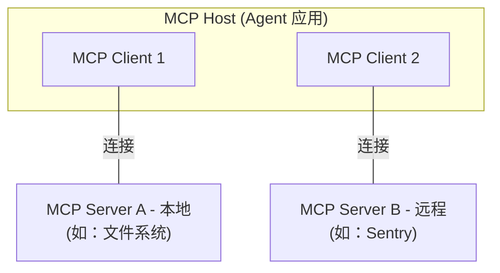
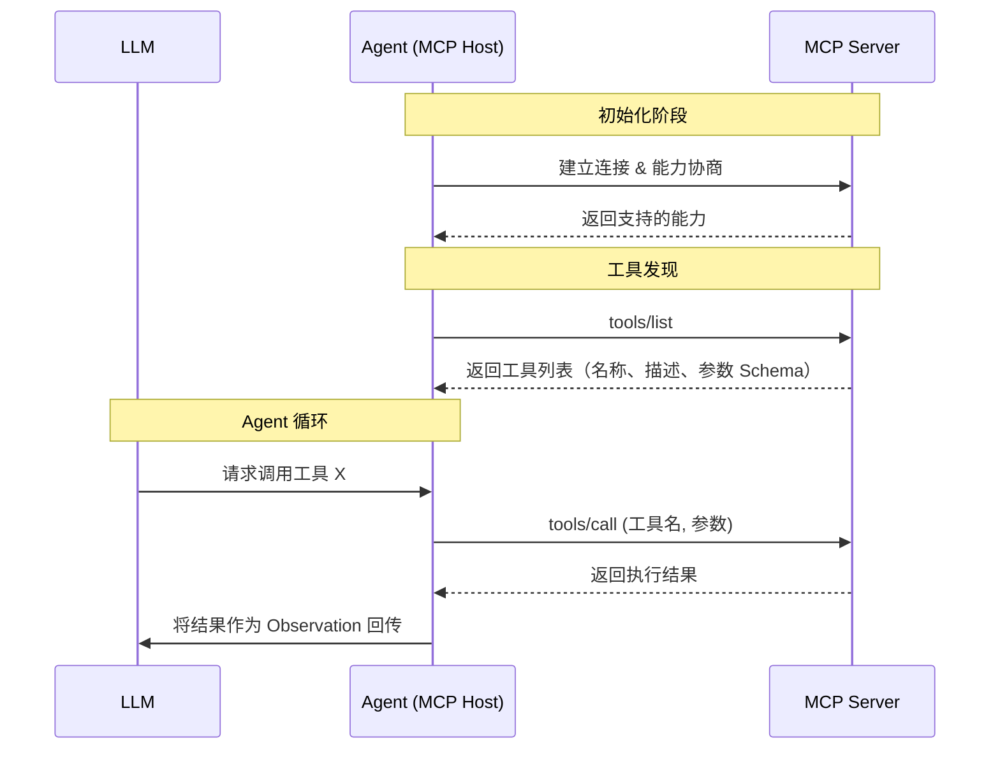

> 建议阅读前先了解 [古明地觉谈 Agent 应用 - 基础篇](/posts/agent-dev-basis-1) 的内容。
> 
> 进阶篇笔者默认读者熟悉相关语言和技术栈的基本使用方法，因此在文中会省略一些基础的介绍和细节，直接进入主题。

通过基础篇的介绍，笔者相信读者已经能够初步开发一个简单的 Agent 应用。从进阶篇开始，笔者将着重于介绍成熟的 Agent 应用常见的组件、模块和功能的开发方法，帮助读者更深入地理解 Agent 应用的开发和设计。

在基础篇中我们曾经介绍过了 Tool Calling，并介绍了如何封装实现工具类来供大模型调用。而作为进阶篇的第一篇，笔者将延续工具调用的话题，介绍 MCP 协议，并介绍如何封装实现 MCP 客户端来供大模型调用。最后简单介绍一下 MCP Server 的开发。

## MCP 简介

在[基础篇 3](/posts/agent-dev-basis-3)中，笔者介绍了如何封装 `Tool` 类和 `ToolManager` 来管理工具调用。在那个方案中，所有工具函数都是在应用内部定义和注册的。这种方式对于内部工具来说简单直接，但当我们需要接入外部服务提供的工具时，就面临一个问题：每个外部服务都可能有不同的接口格式和通信方式，我们不得不为每个外部服务单独编写适配代码。

**MCP（Model Context Protocol）** 正是为了解决这个问题而诞生的。它是一个由 Anthropic 主导的开放协议，定义了 AI 应用与外部工具服务之间的标准化通信规范。借助 MCP，任何遵循该协议的工具服务都可以被任何 MCP 客户端无缝调用，而无需关心对方的具体实现细节。

### 架构

MCP 采用典型的 Client-Server 架构，主要包括：
- **MCP Host**：Agent 应用本身，负责协调和管理多个 MCP 客户端。
- **MCP Client**：Host 内部的一个组件，负责与某一个 MCP Server 维持连接并获取上下文信息。每个 MCP Client 与一个 MCP Server 一一对应。
- **MCP Server**：提供上下文数据和工具能力的外部程序，可以运行在本地，也可以运行在远程。



从协议设计上，MCP 分为两层：
1. **数据层**：基于 [JSON-RPC 2.0](https://www.jsonrpc.org/) 定义了客户端与服务器之间的消息结构和语义。
2. **传输层**：定义了消息的实际传输方式。常见的传输方式包括：
   - **Stdio**：客户端以子进程的方式启动 MCP Server，通过标准输入/输出通信。适用于本地服务，无网络开销。
   - **Streamable HTTP**：通过 HTTP POST 和 SSE（Server-Sent Events）进行通信。适用于远程服务，支持标准 HTTP 认证。

### 工具调用流程
从 Agent 应用的视角来看，MCP 工具调用的流程如下：



可以看到，MCP 工具的发现和调用模式与我们在基础篇中自建的 `ToolManager.to_openai_schema()` + `ToolManager.dispatch()` 非常相似——MCP 只是将这套流程标准化到了进程间甚至网络间的通信层面。

## MCP 调用
### MCP 客户端调用

MCP 官方提供了多语言的 SDK[^mcp-sdk]，笔者这里以 Python SDK 为例介绍如何调用 MCP Server。

[^mcp-sdk]: MCP SDK 列表见 [MCP SDKs](https://modelcontextprotocol.io/docs/sdk)。

MCP Python SDK 提供了异步的客户端接口。以下是一个连接到本地 Stdio MCP Server 并列出、调用工具的基本示例：
```python
import asyncio
from contextlib import AsyncExitStack
from mcp import ClientSession, StdioServerParameters
from mcp.client.stdio import stdio_client

async def main():
    exit_stack = AsyncExitStack()
    # 定义 MCP Server 的启动参数（以一个 Python 脚本为例）
    server_params = StdioServerParameters(
        command="python",
        args=["path/to/mcp_server.py"],
    )
    # 建立连接
    transport = await exit_stack.enter_async_context(stdio_client(server_params))
    read_stream, write_stream = transport
    session = await exit_stack.enter_async_context(
        ClientSession(read_stream, write_stream)
    )
    # 初始化连接（能力协商）
    await session.initialize()
    # 列出可用工具
    tools_response = await session.list_tools()
    for tool in tools_response.tools:
        print(f"工具: {tool.name} - {tool.description}")
        # tool.inputSchema 包含参数的 JSON Schema
    # 调用工具
    result = await session.call_tool(
        "get_current_weather",
        arguments={"location": "San Francisco, CA"}
    )
    print(result.content)  # 工具执行结果
    await exit_stack.aclose()

asyncio.run(main())
```

在这个示例中，我们通过 `stdio_client` 启动了一个 MCP Server 子进程，并通过 `ClientSession` 与之通信。`list_tools()` 返回的工具列表中，每个工具都包含 `name`、`description` 和 `inputSchema`，这些信息与我们在基础篇中 `Tool.to_openai_schema()` 输出的格式本质上是相同的。

### 集成到封装管理

接下来笔者将说明如何将 MCP 工具无缝集成到我们在[基础篇 3](/posts/agent-dev-basis-3)中构建的 `ToolManager` 体系中。

回顾一下基础篇的封装：我们有一个 `Tool` 类负责将 Python 函数封装为可被 LLM 调用的工具，以及一个 `ToolManager` 负责注册、导出 Schema 和派发调用。现在我们需要做的是：让来自 MCP Server 的工具看起来和本地工具一模一样，这样 ReAct Agent 无需关心一个工具到底是本地函数还是远程 MCP 服务。

#### MCPTool 适配器

我们首先创建一个 `MCPTool` 类，将 MCP 工具适配为 `Tool` 接口：

```python
# tool/mcp_tool.py
import asyncio
from typing import Any
from mcp import ClientSession
from .base import Tool

class MCPTool(Tool):
    """将 MCP Server 的一个工具适配为本地 Tool 接口。"""
    def __init__(
        self,
        name: str,
        description: str,
        input_schema: dict[str, Any],
        session: ClientSession,
    ) -> None:
        # 跳过父类的函数签名解析，直接设置属性
        self.name = name
        self.description = description
        self._input_schema = input_schema
        self._session = session

    @property
    def parameters_schema(self) -> dict[str, Any]:
        """直接使用 MCP Server 返回的 JSON Schema。"""
        schema = dict(self._input_schema)
        schema.pop("title", None)
        return schema

    def invoke(self, arguments: dict[str, Any]) -> Any:
        """通过 MCP 协议调用远程工具。"""
        # MCP SDK 是异步的，在同步 invoke 中桥接
        loop = asyncio.get_event_loop()
        if loop.is_running():
            import concurrent.futures
            with concurrent.futures.ThreadPoolExecutor() as pool:
                result = pool.submit(
                    asyncio.run,
                    self._session.call_tool(self.name, arguments=arguments)
                ).result()
        else:
            result = asyncio.run(
                self._session.call_tool(self.name, arguments=arguments)
            )
        # 提取文本内容
        texts = [c.text for c in result.content if hasattr(c, "text")]
        return "\n".join(texts) if texts else str(result.content)
```

`MCPTool` 将复用 MCP Server 已经提供的元信息，而不再从本地函数签名中推导，同时将 `invoke` 方法委托给 MCP `session.call_tool`。

#### 注册 MCP 工具到 ToolManager

有了 `MCPTool` 之后，我们只需要在连接 MCP Server 时，遍历其工具列表并注册到 `ToolManager` 中：

```python
# tool/mcp_loader.py
from mcp import ClientSession, StdioServerParameters
from mcp.client.stdio import stdio_client
from contextlib import AsyncExitStack
from .mcp_tool import MCPTool
from .manager import ToolManager

async def load_mcp_tools(
    manager: ToolManager,
    server_params: StdioServerParameters,
    exit_stack: AsyncExitStack,
) -> ClientSession:
    """连接 MCP Server 并将其工具注册到 ToolManager。"""
    transport = await exit_stack.enter_async_context(stdio_client(server_params))
    read_stream, write_stream = transport
    session = await exit_stack.enter_async_context(
        ClientSession(read_stream, write_stream)
    )
    await session.initialize()
    # 遍历 MCP Server 的工具列表，逐一注册
    tools_response = await session.list_tools()
    for tool_info in tools_response.tools:
        mcp_tool = MCPTool(
            name=tool_info.name,
            description=tool_info.description or "",
            input_schema=tool_info.inputSchema,
            session=session,
        )
        manager.register(mcp_tool)
    return session
```

#### 使用方式

经过上述适配后，从 `ToolManager` 的角度来看，MCP 工具和本地工具完全一致。在 Agent 的 ReAct 循环中，无需做任何修改：

```python
from contextlib import AsyncExitStack
from mcp import StdioServerParameters
from tool.manager import default_manager, tool
from tool.mcp_loader import load_mcp_tools
# 本地工具照常注册
@tool
def calculate(expression: str) -> str:
    """计算数学表达式。"""
    return str(eval(expression))
# MCP 工具通过 loader 注册
async def setup():
    exit_stack = AsyncExitStack()
    await exit_stack.__aenter__()
    await load_mcp_tools(
        default_manager,
        StdioServerParameters(command="python", args=["servers/weather_server.py"]),
        exit_stack,
    )
    # 此时 default_manager 中同时包含本地工具和 MCP 工具
    schema = default_manager.to_openai_schema()
    # schema 会包含 calculate 和 MCP Server 提供的所有工具
    return exit_stack
```

这样我们就实现了本地工具与 MCP 工具的统一管理。

## MCP Server 开发

在了解了如何作为客户端调用 MCP Server 之后，笔者再简单介绍一下如何开发一个 MCP Server。MCP Python SDK 提供了 `FastMCP` 这个高层封装，使得 Server 的开发体验与我们在基础篇中用装饰器注册工具非常类似。

```python
# servers/weather_server.py
from mcp.server.fastmcp import FastMCP
mcp = FastMCP("weather")

@mcp.tool()
async def get_current_weather(location: str) -> str:
    """获取指定位置的当前天气信息。
    Args:
        location: 城市与省份/州，例如 San Francisco, CA
    """
    # 实际实现中这里会调用第三方天气 API
    return f"{location} 晴，25°C。"

@mcp.tool()
async def get_forecast(latitude: float, longitude: float) -> str:
    """获取指定坐标的天气预报。
    Args:
        latitude: 纬度
        longitude: 经度
    """
    return f"({latitude}, {longitude}) 未来三天：晴转多云，20-28°C。"

if __name__ == "__main__":
    mcp.run(transport="stdio")
```

可以看到，`FastMCP` 的 `@mcp.tool()` 装饰器与我们在基础篇中实现的 `@tool` 装饰器在使用方式上如出一辙——都是通过函数签名、类型注解和 docstring 自动推导工具的元信息。`FastMCP` 会自动将函数封装为符合 MCP 协议规范的工具，并在调用 `mcp.run()` 时启动 Server 开始监听请求。

对于更复杂的 MCP Server，你还可以暴露 **Resources** 和 **Prompts**，感兴趣的读者可以参阅[官方文档](https://modelcontextprotocol.io/docs/develop/build-server)，本文就不再赘述了。