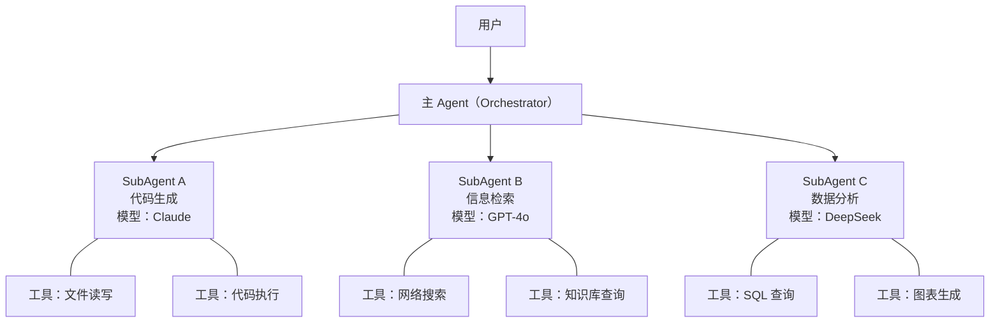
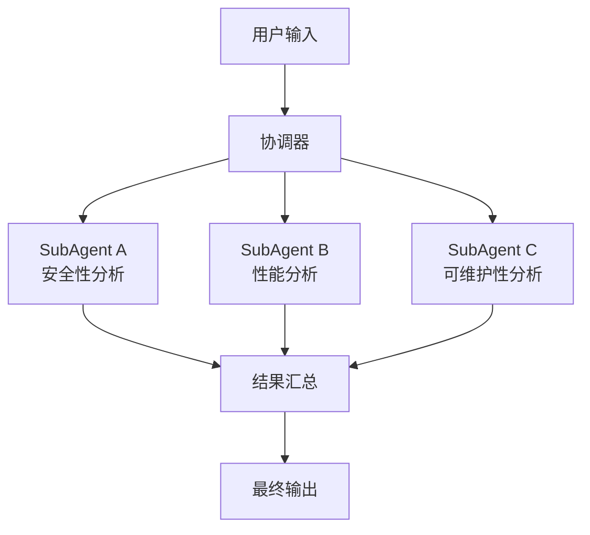

在[基础篇 3](/posts/agent-dev-basis-3)中，笔者曾介绍过 ReAct Agent 的设计范式并说明过大模型如何通过工具调用实现和外部环境的交互。但是直接将所有工具提供给一个 LLM 来调用在实践中可能会遇到一些问题，比如：
1. 过多工具影响大模型的决策效率和准确率，尤其是当工具数量较多且功能复杂时。
2. 大量信息占据上下文窗口，导致模型无法有效利用工具调用的结果。
3. 使用的 LLM 可能在擅长的领域和不擅长的领域都有工具调用需求，单一模型难以兼顾。

为了解决这些问题，SubAgent 架构应运而生。SubAgent 架构的核心思想是将一个复杂的 Agent 应用拆分成多个功能单一、职责明确的 SubAgent，每个 SubAgent 负责调用特定的一组工具，并且每个 SubAgent 都可以使用最适合其任务的 LLM。这种架构不仅可以提高工具调用的效率和准确率，还可以更好地利用上下文窗口，并且使得整个系统更加模块化和可维护。

## SubAgent 架构设计

笔者从经验上总结出了两种 SubAgent 架构的设计模式，分别是层级式和并行式。

### 层级式

层级式架构是最直觉的 SubAgent 组织方式：一个**主 Agent（Orchestrator）** 作为入口接收用户输入，根据任务类型将请求分派给不同的 SubAgent 处理，每个 SubAgent 拥有独立的工具集、System Prompt 甚至不同的 LLM。以下面完成代码生成任务为例，我们可以将架构设计为：



这样就可以解决笔者在前面提到的痛点：

1. 每个 SubAgent 只看到与自己职责相关的工具，避免了大量无关工具干扰 LLM 的决策。比如一个负责代码生成的 SubAgent 不需要看到 SQL 查询工具，反之亦然。
2. 不同的 SubAgent 可以选择最适合其任务的模型。例如代码生成任务可以使用 Claude，而信息检索任务可以使用更快、更便宜的模型。
3. 每个 SubAgent 维护自己的对话历史，不会被其他 SubAgent 的中间过程污染上下文窗口。主 Agent 只接收 SubAgent 的最终输出。

层级式架构也可以是多层嵌套的，一个 SubAgent 本身可以作为更低层 SubAgent 的 Orchestrator，形成树状结构。但笔者建议层级不要超过两到三层，否则调用链过长会导致延迟增大和错误传播。

### 并行式

并行式架构适用于一个任务可以被分解为多个相互独立的子任务的场景。与层级式中主 Agent 按需选择某一个 SubAgent 不同，并行式中多个 SubAgent 同时执行，最后由一个协调者汇总结果。以下面代码审查任务为例，我们可以设计如下架构：



并行式架构的关键在于结果汇总策略。汇总可以是简单的拼接，也可以再通过一个 LLM 来综合各个 SubAgent 的输出。笔者的经验是，对于结构化输出（如各维度的评分），直接拼接即可；对于自然语言输出，通常需要一个汇总 Agent 来整合各方结论并消除矛盾。

值得注意的是，层级式和并行式并不互斥，实际应用中经常混合使用。例如主 Agent 先将任务路由给某个 SubAgent（层级式），而该 SubAgent 内部再将子任务拆分为并行执行的多个 Worker（并行式）。

## SubAgent 的实现

### 封装为工具调用

在前面的文章中我们已经建立了一个统一的 `Tool` / `ToolManager` 体系，在[进阶篇 1](/posts/agent-dev-advanced-1)中又通过 `MCPTool` 适配器将 MCP 工具纳入了同一套管理。同样的思路也可以应用到 SubAgent 上：将 SubAgent 封装为一个 Tool，这样主 Agent 可以像调用任何普通工具一样调用 SubAgent。

首先，我们定义一个 `SubAgent` 类来封装一个独立的 Agent 实例。

在[基础篇 4](/posts/agent-dev-basis-4)中，笔者介绍了通过 `PromptManager` 将 Prompt 作为资源文件（YAML）来管理的方法。在 SubAgent 架构中，每个 SubAgent 都有自己专属的 System Prompt，这些 Prompt 更应当纳入统一的管理体系，而不是散落在各处的字符串常量。我们先为 SubAgent 准备 Prompt 模板文件。假设我们要创建一个代码助手和一个信息检索助手：

```yaml
# prompts/templates/sub_agents.yaml

code_assistant:
    provider: anthropic
    model: claude-sonnet
    description: 代码助手，擅长编写和执行 Python 代码
    system: |
        你是一个代码助手，擅长编写和执行 Python 代码来解决问题。
        请根据用户的需求编写代码，并在需要时使用提供的工具来执行代码。
        确保代码安全、高效且符合最佳实践。

search_assistant:
    provider: openai
    model: gpt-4o
    description: 信息检索助手，擅长通过搜索工具获取最新信息
    system: |
        你是一个信息检索助手，擅长通过搜索工具获取最新信息。
        当用户需要查找信息时，请使用搜索工具获取相关资料，
        然后对检索结果进行整理和总结，给出准确且有条理的回答。
```

定义 `SubAgent`：

```python
# agent/sub_agent.py
from dataclasses import dataclass, field
from client.base import BaseClient
from tool.manager import ToolManager
from prompt.manager import PromptManager
import json

@dataclass
class SubAgent:
    """一个独立的 SubAgent，拥有自己的 Client、工具集和 Prompt 配置。"""

    name: str
    """SubAgent 的名称，用于标识和日志。"""

    client: BaseClient
    """该 SubAgent 使用的 LLM 客户端（可以与主 Agent 使用不同的模型）。"""

    tool_manager: ToolManager
    """该 SubAgent 专属的工具管理器。"""

    prompt_manager: PromptManager
    """Prompt 管理器，用于加载和渲染 Prompt 模板。"""

    prompt_name: str
    """该 SubAgent 在 Prompt 模板文件中对应的键名（如 'code_assistant'）。"""

    max_steps: int = 8
    """ReAct 循环的最大步数。"""

    @property
    def system_prompt(self) -> str:
        """从 PromptManager 加载 System Prompt。"""
        prompt_data = self.prompt_manager.load_prompt(self.prompt_name)
        return prompt_data["system"]

    def run(self, user_input: str) -> str:
        """执行 SubAgent 的 ReAct 循环，返回最终答复。"""
        messages: list[dict] = [
            {"role": "system", "content": self.system_prompt},
            {"role": "user", "content": user_input},
        ]

        tools_schema = self.tool_manager.to_openai_schema()

        for _ in range(self.max_steps):
            resp = self.client.chat(messages, tools=tools_schema)

            messages.append({
                "role": "assistant",
                "content": resp.content,
                "tool_calls": [
                    {
                        "id": c.id,
                        "type": "function",
                        "function": {
                            "name": c.function.name,
                            "arguments": c.function.arguments,
                        },
                    }
                    for c in resp.tool_calls
                ],
            })

            if not resp.tool_calls:
                return resp.content

            for call in resp.tool_calls:
                observation = self.tool_manager.dispatch(
                    call.function.name, call.function.arguments
                )
                messages.append({
                    "role": "tool",
                    "tool_call_id": call.id,
                    "content": json.dumps(observation, ensure_ascii=False, default=str),
                })

        return f"[{self.name}] ReAct 循环超过 {self.max_steps} 步未收敛"
```

与基础篇中的 `run_react` 函数相比，`SubAgent` 将 Client、ToolManager 和 Prompt 配置封装在了同一个对象中，使得每个 SubAgent 都是自包含的。同时，Prompt 通过 `PromptManager` 统一管理，当我们需要调整某个 SubAgent 的行为时，只需修改 YAML 文件，无需改动代码。此外，YAML 文件中同时记录了 `provider` 和 `model` 等元信息，在实际项目中可以进一步利用这些配置来自动创建对应的 Client 实例，实现 SubAgent 的声明式配置。

接下来，我们创建一个 `SubAgentTool`，将 `SubAgent` 适配为 `Tool` 接口。这和[进阶篇 1](/posts/agent-dev-advanced-1)中用 `MCPTool` 适配 MCP 工具的思路完全一致：

```python
# tool/sub_agent_tool.py
from typing import Any, Annotated
from pydantic import Field
from .base import Tool
from agent.sub_agent import SubAgent

class SubAgentTool(Tool):
    """将一个 SubAgent 封装为可被主 Agent 调用的工具。"""

    def __init__(self, sub_agent: SubAgent, description: str) -> None:
        self.name = sub_agent.name
        self.description = description
        self._sub_agent = sub_agent
        # SubAgent 作为工具只接收一个 query 参数
        self._params_model = self._build_query_model()

    @staticmethod
    def _build_query_model():
        from pydantic import create_model
        return create_model(
            "SubAgentParams",
            query=(Annotated[str, Field(description="发送给该 SubAgent 的任务描述或问题")], ...),
        )

    @property
    def parameters_schema(self) -> dict[str, Any]:
        schema = self._params_model.model_json_schema()
        schema.pop("title", None)
        return schema

    def invoke(self, arguments: dict[str, Any]) -> Any:
        """调用 SubAgent 并返回其最终输出。"""
        query = arguments.get("query", "")
        return self._sub_agent.run(query)
```

`SubAgentTool` 的入参被简化为一个 `query` 字符串，主 Agent 只需要告诉 SubAgent 任务内容，而 SubAgent 内部的工具调用、多轮推理等细节对主 Agent 完全透明。

最后，我们将整个流程串联起来：

```python
# main.py
from client.openai_client import OpenAIClient
from tool.manager import ToolManager, default_manager
from tool.sub_agent_tool import SubAgentTool
from agent.sub_agent import SubAgent
from prompt.manager import PromptManager

prompt_mgr = PromptManager()

# SubAgent: 代码助手
code_tools = ToolManager()

@code_tools.tool
def execute_python(code: str) -> str:
    """在沙箱中执行 Python 代码并返回输出。"""
    # 实际实现中应使用安全沙箱
    import io, contextlib
    f = io.StringIO()
    with contextlib.redirect_stdout(f):
        exec(code)
    return f.getvalue()

code_agent = SubAgent(
    name="code_assistant",
    client=OpenAIClient(),  # 可以配置为使用不同的模型
    tool_manager=code_tools,
    prompt_manager=prompt_mgr,
    prompt_name="sub_agents/code_assistant",  # 对应 YAML 文件中的键路径
)

# SubAgent: 信息检索助手
search_tools = ToolManager()

@search_tools.tool
def web_search(query: str) -> str:
    """搜索互联网获取信息。"""
    return f"搜索结果：关于 '{query}' 的相关信息..."

search_agent = SubAgent(
    name="search_assistant",
    client=OpenAIClient(),
    tool_manager=search_tools,
    prompt_manager=prompt_mgr,
    prompt_name="sub_agents/search_assistant",  # 对应 YAML 文件中的键路径
)

# 将 SubAgent 注册为主 Agent 的工具
default_manager.register(SubAgentTool(
    code_agent,
    description="调用代码助手来编写和执行 Python 代码，适用于需要计算、数据处理或编程的任务。",
))
default_manager.register(SubAgentTool(
    search_agent,
    description="调用信息检索助手来搜索互联网，适用于需要查找最新资讯或知识的任务。",
))

# 主 Agent
main_client = OpenAIClient()

def run_main_agent(user_input: str) -> str:
    """主 Agent 的 ReAct 循环。"""
    from agent.react import run_react  # 复用基础篇的 ReAct 实现
    return run_react(main_client, user_input)
```

可以看到，整个 SubAgent 体系的实现并没有引入新的调度机制——它完全建立在我们已有的 `Tool` / `ToolManager` 抽象之上。主 Agent 调用 `code_assistant` 工具时，`ToolManager.dispatch()` 会找到对应的 `SubAgentTool`，后者再调用 `SubAgent.run()` 执行一轮完整的 ReAct 循环。从主 Agent 的视角看，这和调用一个普通的函数工具没有任何区别。

### 多 Agent 协同通信

在上面的实现中，主 Agent 和 SubAgent 之间的通信是单向的：主 Agent 发送 `query`，SubAgent 返回结果。这种模式对于层级式架构已经足够，但在更复杂的场景下（尤其是并行式），我们可能需要更丰富的通信机制。

#### 上下文传递

在很多实际场景中，SubAgent 需要获取主 Agent 已经持有的上下文信息。例如主 Agent 在前几轮对话中已经收集了一些关键信息，SubAgent 在执行任务时需要引用这些信息。

一种简单且实用的做法是在调用 SubAgent 时将上下文嵌入到 `query` 中。我们可以对 `SubAgent.run()` 做一个小扩展：

```python
# agent/sub_agent.py（扩展 run 方法）

def run(self, user_input: str, context: str | None = None) -> str:
    """执行 SubAgent 的 ReAct 循环。

    Args:
        user_input: 用户/主 Agent 发送的任务描述。
        context: 可选的上下文信息，会被注入到 System Prompt 末尾。
    """
    system = self.system_prompt  # 从 PromptManager 加载
    if context:
        system += f"\n\n## 上下文信息\n{context}"

    messages: list[dict] = [
        {"role": "system", "content": system},
        {"role": "user", "content": user_input},
    ]
    # ... 后续 ReAct 循环逻辑不变
```

相应地，`SubAgentTool.invoke()` 也需要支持传递上下文：

```python
# tool/sub_agent_tool.py（扩展 invoke 方法）

def invoke(self, arguments: dict[str, Any]) -> Any:
    query = arguments.get("query", "")
    context = arguments.get("context", None)
    return self._sub_agent.run(query, context=context)
```

#### 并行执行与结果汇总

对于并行式架构，我们需要一个协调器来同时启动多个 SubAgent 并收集结果。利用 Python 的 `concurrent.futures` 可以直接实现：

```python
# agent/parallel.py
from concurrent.futures import ThreadPoolExecutor, as_completed
from agent.sub_agent import SubAgent

def run_parallel(
    sub_agents: list[SubAgent],
    user_input: str,
    context: str | None = None,
) -> dict[str, str]:
    """并行执行多个 SubAgent，返回各自的结果。"""
    results: dict[str, str] = {}

    with ThreadPoolExecutor(max_workers=len(sub_agents)) as pool:
        futures = {
            pool.submit(agent.run, user_input, context): agent.name
            for agent in sub_agents
        }
        for future in as_completed(futures):
            agent_name = futures[future]
            try:
                results[agent_name] = future.result()
            except Exception as e:
                results[agent_name] = f"[错误] {e}"

    return results
```

拿到并行结果后，我们可以将其汇总传递给一个汇总 Agent。同样地，汇总 Agent 的 Prompt 也应当通过 `PromptManager` 来管理：

```yaml
# prompts/templates/sub_agents.yaml（追加汇总 Agent 的 Prompt）

result_aggregator:
    description: 将多个 SubAgent 的分析结果汇总为最终输出
    system: |
        你是一个结果汇总专家。下面是多个分析 Agent 对同一个问题的分析结果，
        请综合这些结果，给出一份结构清晰、消除矛盾的最终总结。
    user: |
        ## 原始问题
        {user_input}

        ## 各 Agent 分析结果
        {combined}
```

```python
# agent/aggregate.py
from client.openai_client import OpenAIClient
from prompt.manager import PromptManager

def aggregate_results(
    client: OpenAIClient,
    prompt_manager: PromptManager,
    user_input: str,
    results: dict[str, str],
) -> str:
    """将多个 SubAgent 的结果汇总为最终输出。"""
    parts = []
    for name, result in results.items():
        parts.append(f"### {name} 的分析结果\n{result}")

    combined = "\n\n".join(parts)

    # 通过 PromptManager 渲染汇总 Prompt
    messages = prompt_manager.render(
        "sub_agents/result_aggregator",
        user_input=user_input,
        combined=combined,
    )

    resp = client.chat(messages)
    return resp.content
```

以一个代码审查场景为例，我们先准备审查 Agent 的 Prompt 模板：

```yaml
# prompts/templates/code_review.yaml

security_reviewer:
    description: 安全性审查专家
    system: |
        你是安全专家，专注于分析代码中的安全漏洞和风险。
        请从注入攻击、权限控制、数据泄露等角度进行审查。

performance_reviewer:
    description: 性能审查专家
    system: |
        你是性能专家，专注于分析代码的性能瓶颈和优化建议。
        请从算法复杂度、内存使用、I/O 效率等角度进行审查。

style_reviewer:
    description: 代码规范审查专家
    system: |
        你是代码规范专家，专注于检查代码风格和最佳实践。
        请从命名规范、代码结构、可读性等角度进行审查。
```

然后整个并行 + 汇总的流程如下：

```python
from agent.sub_agent import SubAgent
from agent.parallel import run_parallel
from agent.aggregate import aggregate_results
from client.openai_client import OpenAIClient
from tool.manager import ToolManager
from prompt.manager import PromptManager

prompt_mgr = PromptManager()

# 定义三个并行审查 Agent，Prompt 均从 YAML 加载
security_agent = SubAgent(
    name="安全性审查",
    client=OpenAIClient(),
    tool_manager=ToolManager(),
    prompt_manager=prompt_mgr,
    prompt_name="code_review/security_reviewer",
)
performance_agent = SubAgent(
    name="性能审查",
    client=OpenAIClient(),
    tool_manager=ToolManager(),
    prompt_manager=prompt_mgr,
    prompt_name="code_review/performance_reviewer",
)
style_agent = SubAgent(
    name="代码规范审查",
    client=OpenAIClient(),
    tool_manager=ToolManager(),
    prompt_manager=prompt_mgr,
    prompt_name="code_review/style_reviewer",
)

# 并行执行
code_to_review = "..."  # 待审查的代码
results = run_parallel(
    [security_agent, performance_agent, style_agent],
    user_input=f"请审查以下代码：\n```python\n{code_to_review}\n```",
)

# 汇总结果
final_review = aggregate_results(
    OpenAIClient(),
    prompt_mgr,
    user_input=f"代码审查：\n{code_to_review}",
    results=results,
)
print(final_review)
```