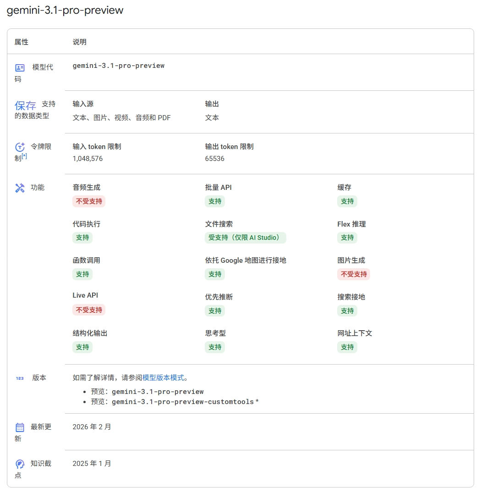
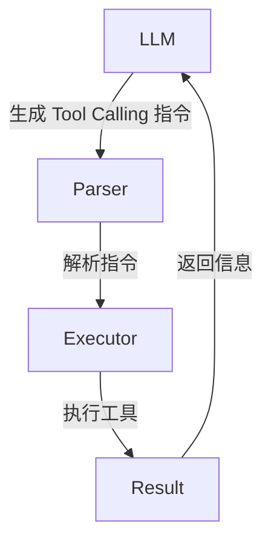
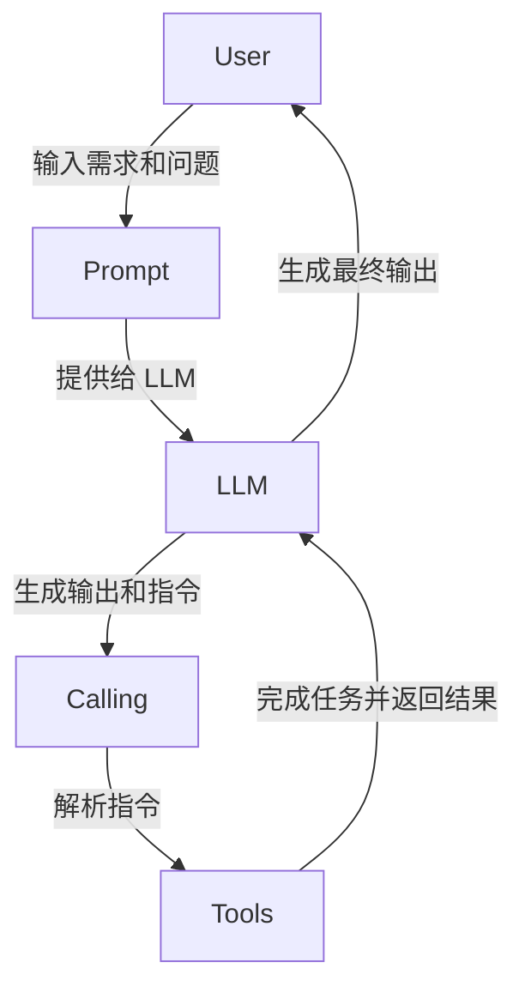
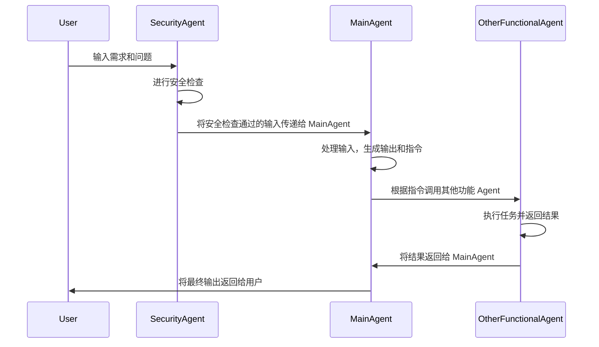

在大语言模型刚开始兴起的时候，笔者还只会在网页端和各家的 App 里对话。当时不论是笔者还是其他人都没有想到，一个仅能生成文字的模型，在未来会作为 Agent 的核心组件，去控制各种各样的工具，甚至是物理设备，来完成各种复杂的任务。

笔者真正开始制作并逐渐熟悉 Agent 应用是在 2025 年尝试制作 QQ 群聊机器人时。从最开始只希望机器人带有人格化的对话能力，到后来逐渐加入了各种工具的使用，笔者才真正体会到 Agent 应用的魅力和潜力。并在之后的一年里笔者不断尝试制作各种各样的 Agent 应用，从简单的文本生成到复杂的 Workflow，笔者对于 Agent 应用的理解也在不断加深。

## LLM

在开始介绍 Agent 应用之前，笔者认为有必要先介绍一下 Agent 应用的核心组件之一：大语言模型（LLM）。

**LLM** 就如同一个大脑，它可以理解输入的信息，再产生相应的输出。它的输入可以是文本、图片、音频等多**模态**信息，而输出也可以是文本、图片、音频等多模态信息。但是需要注意的是，LLM 本身并不具备执行工具的能力，它只能生成文本输出。要让 LLM 能够控制工具，我们需要在它的输出中包含一些特定的指令，这些指令可以被后续的组件解析和执行。

那么我们如何了解一个 LLM 的参数和能力呢？通常而言只需要通过文档了解以下信息：
- 模型支持的输入和输出的模态
- 模型的上下文窗口大小
- 模型的参数量
- 模型是否支持结构化输出
- 模型是否支持工具调用
- 模型的成本

以 [Google Gemini 3.1 Pro](https://ai.google.dev/gemini-api/docs/models/gemini-3.1-pro-preview?hl=zh-cn) 为例，我们可以看到模型的参数和能力：

笔者在这里强调一下，模型并非越大越好，参数量也并非越多越好。我们需要根据自己的需求和预算来选择合适的模型。对于一些简单的任务，可能一个小模型就足够了；而对于一些复杂的任务，可能需要一个大模型来提供更好的性能和能力。

## Prompt

**Prompt** 就是我们给 LLM 的输入，它可以包含一些指令、上下文信息、示例等内容。一个好的 Prompt 可以帮助 LLM 更好地理解我们的需求，从而产生更准确和有用的输出。

一个基本的 LLM 工作流程实际上包含了 System Prompt、User Prompt 和 Assistant Prompt 三个部分：
- **System Prompt**：系统提示，通常用于设置模型的行为和角色。例如，我们可以在 System Prompt 中告诉模型它是一个什么样的角色（如医生、律师、客服等），以及它应该如何回答用户的问题（如提供详细的解释、给出简洁的答案等）。
- **User Prompt**：用户提示，通常是用户输入的内容，包含了用户的需求和问题。例如，用户可能会输入一个问题、一个请求或者一个指令。
- **Assistant Prompt**：助手提示，通常是模型生成的内容，包含了模型的回答和输出。例如，模型可能会生成一个答案、一个建议或者一个指令。

日常我们使用大模型时，输入的要求或者指令实际上都是 User Prompt 的内容，而 System Prompt 的内容则是由模型的开发者或者使用者预先设置好的。作为 Agent 应用的开发者，我们需要根据自己的需求来设计和设置 System Prompt，以便让模型能够更好地理解我们的需求和产生更有用的输出。

在后续的文章中，笔者会介绍 System Prompt 的设计原则和一些常见的写法。

## Tool Calling, MCP, Skills

如前所述，LLM 本身并不具备执行工具的能力，它只能生成文本输出。要让 LLM 能够控制工具，我们需要在它的输出中包含一些特定的指令，这些指令可以被后续的组件解析和执行。这些指令通常被称为 **Tool Calling**，它们可以告诉后续的组件应该调用哪个工具，以及应该传递什么参数。

一般而言，工具在执行结束之后还需要返回信息给 LLM，以便 LLM 可以根据工具的执行结果来继续生成后续的输出。

**MCP** 协议是一种用于 LLM 和工具之间通信的协议，它定义了工具调用的格式和规范[^anthropic-mcp]。通常而言我们可以将其理解为一个“工具包”

[^anthropic-mcp]: [MCP 文档](https://modelcontextprotocol.io/docs/getting-started/intro)

**Skills** 则是为了解决过多工具信息可能占用过多上下文窗口的问题而提出的一种解决方案[^skills-doc]。其核心思想在于不让模型看到所有工具的细节信息，而是先给模型各个工具包的简介信息，让模型先选择需要使用哪个工具包，然后再给模型看到该工具包中工具的详细信息。这样可以有效地减少模型需要处理的信息量，从而提高模型的性能和效率。

[^skills-doc]: [Skills 文档](https://support.claude.com/en/articles/12512176-what-are-skills)

总的来说，Tool Calling、MCP 和 Skills 都是为了让 LLM 能够控制工具而设计的机制和协议。这就像是为一个只有大脑的机器人装上了躯干和四肢，让 LLM 能够真正的去执行各种各样的任务，而不仅仅是生成文本输出。

## Agent, Agent 应用

**Agent** 就是一个能够使用工具的智能体，它可以根据用户的需求和问题来选择合适的工具，并通过工具来完成各种各样的任务。一个 Agent 通常包含以下几个核心组件：
- **LLM**：作为 Agent 的大脑，负责理解输入的信息，并产生相应的输出。
- **Prompt**：作为 Agent 的输入，包含了用户的需求和问题，以及系统的设置和指令。
- **Tool Calling**：作为 Agent 的执行机制，负责解析 LLM 生成的指令，并调用相应的工具来完成任务。
- **Tools**：作为 Agent 的执行对象，负责完成各种各样的任务，如查询信息、处理数据、控制设备等。

而一个完整的 **Agent 应用** 则是由一个或多个 Agent 组成的系统，它可以通过 Agent 来完成各种各样的任务和功能。例如，在笔者的 QQ 群聊机器人中，事实上包含了多个 Agent 协作。下面是一个简单的示例，展示了一个包含安全检查 Agent、主 Agent 和其他功能 Agent 的系统：

在这里，笔者额外评注一下，大家直接在网页端或者应用端使用的各家大模型（例如：Deepseek 应用/网页端）其实也是一个 Agent 应用，而应用本身的能力不一定能体现说明模型的能力。