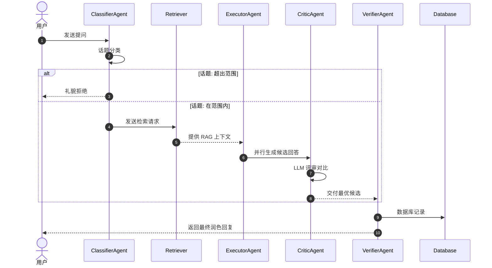
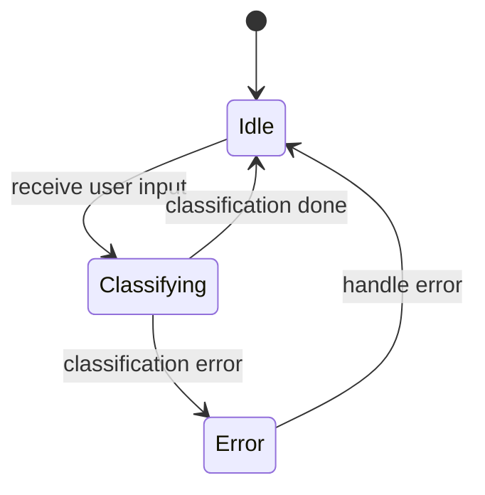

在上一篇文章中，笔者介绍了 Agent 应用中涉及到的基本概念。在这一篇文章中，笔者将介绍 Agent 应用设计的一些原则和方法。

## Workflow 与状态机

在笔者的实践中，笔者常常将 Agent 应用视作一条对信息加工处理的流水线，也即所谓的 Workflow。这样处理的好处是显然的，首先每个步骤都可以拆出来单独测试和优化，并定义清晰的输入输出接口；其次，流水线的每个步骤都可以独立地进行并行处理，从而提高效率。值得注意的是，在 Agent 应用中并不一定每一个步骤或流程中都需要一个 Agent 来处理。我们可以根据具体的需求和场景，选择合适的工具和方法来实现每个步骤。

而为了管理 Workflow 中的状态和流程，笔者通常会使用状态机（State Machine）的概念。状态机可以帮助我们清晰地定义 Agent 应用中不同阶段的状态，以及在不同状态之间的转换条件和行为。这种方法不仅使得代码结构更加清晰，还能提高系统的可维护性和扩展性。

### Workflow 示例

笔者以一个简化版的智能客服系统为例[^cphos-ai-customer-service]，来说明 Workflow 和状态机的应用。在 Workflow 中，笔者推荐采用时序图（Sequence Diagram）来描述不同步骤之间的交互和数据流。

[^cphos-ai-customer-service]: 参考了 [CPHOS AI Customer Service](https://github.com/CPHOS/AI-Customer-Service)的实现，进行了简化和改编。



在这个简化的智能客服系统中，用户首先向 `ClassifierAgent` 发送提问，`ClassifierAgent` 对提问进行话题分类。如果话题超出范围，`ClassifierAgent` 会礼貌地拒绝用户；如果话题在范围内，`ClassifierAgent` 会向 `Retriever` 发送检索请求，`Retriever` 提供 RAG 上下文给 `ExecutorAgent`。`ExecutorAgent` 会并行生成候选回答，并将这些候选回答交给 `CriticAgent` 进行评审对比。`CriticAgent` 最终会交付最优候选给 `VerifierAgent`，`VerifierAgent` 会将最终的回复返回给用户并自动记录到数据库中。

不难看出，在这个 Workflow 中，每个步骤都有明确的输入输出接口。这使得我们在开发早期便可以快速确定数据模型和接口规范。

```python
# 输入输出数据模型
@dataclass
class UserInput:
    question: str
    imges: Optional[List[bytes]] = None
    files: Optional[List[bytes]] = None

@dataclass
class ClassifiedResult:
    topic: Topic # 一个枚举类，定义了所有支持的话题类型
    query: str # 经过预处理后的查询文本

@dataclass
class RagContext:
    retrieved_docs: List[Document] # 检索到的相关文档列表
    query: str # 经过预处理后的查询文本

@dataclass
class CandidateAnswer:
    answer: str # 生成的候选回答文本
    score: float # 评审得分

@dataclass
class FinalAnswer:
    answer: str # 最终回复文本
    metadata: Dict[str, Any] # 其他相关信息，如生成时间、使用的模型版本等
```

相应的每个步骤也可以很轻松的快速定义出来。例如，`ClassifierAgent` 的核心方法可以定义如下：

```python
# ClassifierAgent 的核心方法
class ClassifierAgent:
    def classify(self, user_input: UserInput) -> ClassifiedResult:
        topic = self._classify_topic(user_input.question)
        query = self._preprocess_query(user_input.question)
        return ClassifiedResult(topic=topic, query=query)

    def _classify_topic(self, question: str) -> Topic:
        # 调用大模型进行话题分类
        return result

    def _preprocess_query(self, question: str) -> str:
        # 调用大模型生成预处理后的查询文本
        return result
```

### 状态机示例

笔者在这里需要说明一下，状态机的思路是既可以应用在整个 Workflow 的层面，也可以应用在 Workflow 中的某个具体步骤的内部逻辑中。以上文中的 `ClassifierAgent` 为例，笔者可以在其内部使用状态机来管理话题分类的流程。假设我们有一个简单的状态机，包含以下状态：



在这个状态机中，`Idle` 状态表示 `ClassifierAgent` 处于空闲状态，等待用户输入；当接收到用户输入时，状态转换到 `Classifying` 状态，进行话题分类；分类完成后，状态转换回 `Idle` 状态；如果在分类过程中发生错误，状态转换到 `Error` 状态，并进行错误处理后再返回 `Idle` 状态。

由此我们可以改进 `ClassifierAgent` 的实现，加入状态机的逻辑：

```python
class ClassifierAgent:
    class State(Enum):
        Idle = 'Idle'
        Classifying = 'Classifying'
        Error = 'Error'

    def __init__(self):
        self.state = self.State.Idle

    def classify(self, user_input: UserInput) -> ClassifiedResult:
        if self.state != self.State.Idle:
            raise Exception("Agent is busy")
        
        self.state = self.State.Classifying
        try:
            topic = self._classify_topic(user_input.question)
            query = self._preprocess_query(user_input.question)
            result = ClassifiedResult(topic=topic, query=query)
            self.state = self.State.Idle
            return result
        except Exception as e:
            self.state = self.State.Error
            # 处理错误
            self.state = self.State.Idle
            raise e
```

通过引入状态机，我们可以更清晰地管理 `ClassifierAgent` 的状态和流程，避免在处理用户输入时出现竞态条件或状态混乱的情况。这种方法同样适用于 Workflow 中的其他步骤，可以帮助我们构建一个更加健壮和可维护的 Agent 应用系统。

## LLM 输出解析

### 结构化输出

在 Agent 应用中，LLM 的结构化输出是一个非常重要的特性。通过让 LLM 输出结构化的数据，我们可以更方便地进行后续的处理和分析。例如，在 `ClassifierAgent` 中，我们可以让 LLM 输出一个包含话题分类结果和预处理查询文本的 JSON 对象，而不是一个纯文本的回答。这样做的好处是显而易见的，我们可以直接将这个 JSON 对象解析成相应的数据模型，避免了文本解析的复杂性和不确定性。

```json
{
    "topic": "A",
    "query": "我想了解一下报名的流程"
}
```

那么显而易见的，我们就可以直接将这个 JSON 对象解析成 `ClassifiedResult` 数据模型：

```python
import json

def parse_classified_result(json_str: str) -> ClassifiedResult:
    data = json.loads(json_str)
    topic = Topic(data['topic'])
    query = data['query']
    return ClassifiedResult(topic=topic, query=query)
```

### 标签解析

在笔者的实践中，时常有模型的结构化输出能力不足，并且 JSON 本身容易出现格式解析错误的情况（例如模型分不清需要转义字符）。因此笔者也经常使用标签解析（Tag Parsing）的方式来让模型输出结构化数据。标签解析的思路是让模型在输出中使用特定的标签来标识不同的数据字段，从而实现结构化输出。例如，我们可以让模型输出如下格式的文本：

```plain
<TOPIC>A</TOPIC>
<QUERY>我想了解一下报名的流程</QUERY>
```

然后我们可以使用正则表达式来解析这些标签，从而提取出相应的数据字段：

```python
import re

def parse_classified_result(text: str) -> ClassifiedResult:
    topic_match = re.search(r'<TOPIC>(.*?)</TOPIC>', text)
    query_match = re.search(r'<QUERY>(.*?)</QUERY>', text)

    if not topic_match or not query_match:
        raise ValueError("Invalid output format")

    topic = Topic(topic_match.group(1))
    query = query_match.group(1)
    return ClassifiedResult(topic=topic, query=query)
```

当然，在存在需要让模型输出复杂的嵌套结构时，标签解析的方式可能会变得比较麻烦和不可靠，这时候我们就需要权衡使用结构化输出还是标签解析的方法了。总的来说，选择哪种方法取决于具体的应用场景和模型的能力，我们需要根据实际情况来做出合理的选择。