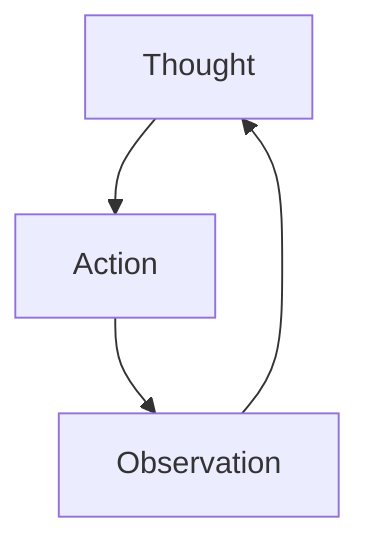

在上一篇文章中，笔者介绍了 Agent 应用设计的一些原则和方法。在这一篇文章中，笔者将以 OpenAI python SDK 为基础，介绍 Agent 的基本开发。

## ReAct Agent

在具体的开发之前，笔者认为有必要介绍一下 **ReAct Agent** 这个概念。ReAct Agent 最先在 2022 年由 Google 的研究人员提出[^react-agent]，它是一种基于 LLM 的 Agent 架构。其核心思想在于，将 LLM 的推理能力和行动能力结合起来，LLM 调用工具获取信息后再思考下一步的行动，这样就形成了一个循环的过程。



[^react-agent]: Yao, S., Zhao, J., Yu, D., Du, N., Shafran, I., Narasimhan, K., & Cao, Y. (2023). ReAct: Synergizing Reasoning and Acting in Language Models. arXiv preprint arXiv:2210.03629. https://arxiv.org/abs/2210.03629

## OpenAI python SDK 基本使用和封装

本章节基于[官方文档](https://developers.openai.com/api/docs/quickstart?language=python)介绍。各位读者请自行安装好环境并获取 API Key。笔者在这里仅讨论文字模态的使用，不涉及图片模态、文件上传等功能，并且笔者在这里会提供根据个人经验在应用层面利于扩展的写法。

### Client 的创建与封装

几乎所有的模型服务商都会支持 OpenAI 的 API 规范，因此 OpenAI python SDK 的使用方法也可以适用于其他模型服务商。我们首先看一下在官方文档中，Client 的创建和一次简单的调用是如何写的：

```python
from openai import OpenAI

client = OpenAI(
    api_key="your_api_key",
    base_url="https://api.openai.com/v1"
)

response = client.chat.completions.create(
    model="model-name",
    messages=[
        {"role": "system", "content": "You are a helpful assistant."},
        {"role": "user", "content": "What is the capital of France?"}
    ],
    # 其他参数
)
```

在这个例子中，我们直接使用了 OpenAI 提供的 Client 类来创建了一个 client 实例，并且直接调用了 `client.chat.completions.create` 方法来生成了一次聊天完成。

虽然这种写法非常直接和简单，但在实际的 Agent 应用开发中，笔者仍然建议大家对 client 进行封装，原因在于：
1. 分离模型服务商、模型选择和 Agent 调用的应用层逻辑，可以让我们的代码更加清晰和易于维护。
2. 可以看到，`messages`的写法不利于我们在 Agent 应用中灵活地构建 Prompt 和数据模型的封装。

这里笔者提供一个简单的封装示例，供大家参考：

首先我们定义一个 `BaseClient` 类，作为我们所有模型服务商的客户端的基类：
```python
# client/base.py
from abc import ABC, abstractmethod
from dataclasses import dataclass, field

@dataclass
class ChatResponse:
    """LLM 单次调用响应。"""

    content: str
    """LLM 输出的文本内容。"""
    # 其他字段，如工具调用指令等，可以在这里添加

class BaseClient(ABC):
    """LLM 客户端基类。"""

    def __init__(self) -> None:
        pass

    @abstractmethod
    def chat(self, messages: list[dict], **kwargs) -> ChatResponse:
        """发送聊天请求并获取响应。"""
        pass
```

然后我们可以针对 OpenAI 的 API 来实现一个 `OpenAIClient` 类，继承自 `BaseClient`：

```python
# client/openai_client.py
from .base import BaseClient, ChatResponse
from openai import OpenAI

class OpenAIClient(BaseClient):
    """OpenAI 客户端实现。"""

    def __init__(self) -> None:
        super().__init__()
        cfg = get_config()  # 获取配置的函数，可以根据实际情况来实现
        self._api_keys = cfg.api_keys # 可以支持多个 API Key 来实现负载均衡等功能
        self._base_url = cfg.base_url or "https://api.openai.com/v1" # 可以支持配置 base_url 来适配不同的模型服务商
        self.model = cfg.model # 可以支持配置模型名称来选择模型
        # 其他配置项，如温度、上下文窗口大小等，也可以在这里进行配置

    def _make_client(self, key_index: int) -> OpenAI:
        """根据 API Key 的索引来创建 OpenAI Client 实例。"""
        return OpenAI(
            api_key=self._api_keys[key_index],
            base_url=self._base_url
        )

    def chat(self, messages: list[dict], **kwargs) -> ChatResponse:
        """发送聊天请求并获取响应。"""
        # 此处实现以轮询 API Key 的方式来进行负载均衡，当然也可以根据其他策略来选择 API Key
        total_keys = len(self._api_keys)
        keys_tried = 0
        last_error: Exception | None = None

        while keys_tried < total_keys:
            key_idx = (self._current_key_index + keys_tried) % total_keys
            client = self._make_client(key_idx)
            retries = 0

            while retries <= self._max_retries: # 对于每个 API Key，我们可以设置一个最大重试次数
                try:
                    response = client.chat.completions.create(
                        model=kwargs.pop("model", self._model),
                        messages=messages,
                        **kwargs,
                    )
                    result = ChatResponse(
                        content=response.choices[0].message.content or ""
                    )
                    # 成功后记住当前 key 以便下次优先使用
                    self._current_key_index = key_idx
                    return result
                except APIError as e:
                    last_error = e
                    retries += 1
                    if retries <= self._max_retries:
                        time.sleep(self._retry_interval) # 可以设置重试间隔来避免过快的重试

            keys_tried += 1

        raise RuntimeError(
            f"所有 API Key ({total_keys} 个) 均已耗尽重试次数"
        ) from last_error
```

当然，笔者在上述提供的示例中还考虑了一些实际应用中可能会遇到的情况，如多个 API Key 的负载均衡、重试机制等。

### Tool Calling 的封装

我们依旧首先参考官方文档中对于工具调用的示例：

```python
tools = [
    {
        "type": "function",
        "name": "get_current_weather",
        "description": "Get the current weather in a given location",
        "parameters": {
            "type": "object",
            "properties": {
                "location": {
                    "type": "string",
                    "description": "The city and state, e.g. San Francisco, CA"
                }
            },
            "required": ["location"]
        }
    }
]

response = client.chat.completions.create(
    model="model-name",
    messages=[
        {"role": "system", "content": "You are a helpful assistant."},
        {"role": "user", "content": "What's the weather like in Boston?"}
    ],
    tools=tools
)
```

在这个示例中，我们直接在调用 `client.chat.completions.create` 方法时传入了一个 `tools` 参数，这个参数包含了我们定义的工具的信息。但类似的，这种写法非常不利于维护和扩展。

我们理想的封装应当做到：只写工具的实现函数，元信息由工具类自动从函数签名、类型注解和 docstring 中推导，并按 OpenAI SDK 的格式自动生成。

笔者在这里提供一个简单的封装示例，供大家参考：

#### 工具基类

我们用 `pydantic` 把参数模型化，其自带 JSON Schema 生成，这样我们就不需要手写任何类型到 schema 的映射表：

```python
# tool/base.py
import inspect
from typing import Any, Callable, get_type_hints
from pydantic import BaseModel, Field, create_model

class Tool:
    """将一个普通 Python 函数封装为可被 LLM 调用的工具。"""

    def __init__(
        self,
        func: Callable[..., Any],
        *,
        name: str | None = None,
        description: str | None = None,
    ) -> None:
        self.func = func
        self.name = name or func.__name__
        self.description = description or (inspect.getdoc(func) or "").split("\n\n", 1)[0]
        self._params_model = self._build_params_model(func)

    @staticmethod
    def _build_params_model(func: Callable[..., Any]) -> type[BaseModel]:
        """根据函数签名动态合成一个 Pydantic 模型，用来生成 JSON Schema。"""
        sig = inspect.signature(func)
        hints = get_type_hints(func)
        fields: dict[str, Any] = {}
        for pname, param in sig.parameters.items():
            if pname == "self" or param.kind in (
                inspect.Parameter.VAR_POSITIONAL,
                inspect.Parameter.VAR_KEYWORD,
            ):
                continue
            annotation = hints.get(pname, str)
            # 参数描述可由调用方通过 Annotated[..., Field(description=...)] 提供；
            default = param.default if param.default is not inspect.Parameter.empty else ...
            fields[pname] = (annotation, default if default is not ... else Field(...))
        # 模型名以工具名为前缀，便于调试时区分
        return create_model(f"{func.__name__}_Params", **fields)  # type: ignore[call-overload]

    @property
    def parameters_schema(self) -> dict[str, Any]:
        """返回符合 OpenAI tools 字段要求的 JSON Schema。"""
        schema = self._params_model.model_json_schema()
        schema.pop("title", None)
        return schema

    def to_openai_schema(self) -> dict[str, Any]:
        """转换为 OpenAI Chat Completions `tools` 数组中的一项。"""
        return {
            "type": "function",
            "function": {
                "name": self.name,
                "description": self.description,
                "parameters": self.parameters_schema,
            },
        }

    def invoke(self, arguments: dict[str, Any]) -> Any:
        """用模型返回的 arguments 执行工具函数"""
        validated = self._params_model(**arguments)
        return self.func(**validated.model_dump())
```

最关键的是，`Tool` 的所有元信息包含在了 `func` 的实现中，我们再也不需要在工具实现之外额外维护一份 name / description / parameters 的定义了。

#### 工具注册表与装饰器

借鉴典型的工厂模式实现，我们可以通过一个**装饰器**来注册工具，并实现一个 `ToolManager` 来管理工具的注册和调用：

```python
# tool/manager.py
import json
from typing import Any, Callable
from .base import Tool

class ToolManager:
    """工具注册表 + 调度器。"""

    def __init__(self) -> None:
        self._tools: dict[str, Tool] = {}

    # 注册
    def register(self, tool: Tool) -> None:
        if tool.name in self._tools:
            raise ValueError(f"工具 {tool.name} 已存在")
        self._tools[tool.name] = tool

    def tool(
        self,
        _func: Callable[..., Any] | None = None,
        *,
        name: str | None = None,
        description: str | None = None,
    ):
        """定义装饰器 `@manager.tool(name=..., description=...)`。"""
        def decorator(func: Callable[..., Any]) -> Callable[..., Any]:
            self.register(Tool(func, name=name, description=description))
            return func  # 原函数保持可直接调用，便于单元测试
        return decorator(_func) if _func is not None else decorator

    # 输出与派发
    def to_openai_schema(self) -> list[dict[str, Any]]:
        """整个注册表导出为 OpenAI SDK 可接受的 tools 参数。"""
        return [t.to_openai_schema() for t in self._tools.values()]

    def dispatch(self, name: str, arguments: str | dict[str, Any]) -> Any:
        """按名称调用工具。arguments 可以是 SDK 返回的 JSON 字符串。"""
        if name not in self._tools:
            raise KeyError(f"未注册的工具：{name}")
        if isinstance(arguments, str):
            arguments = json.loads(arguments or "{}")
        return self._tools[name].invoke(arguments)

# 全局默认实例；大型项目也可以按作用域拆分多个 manager
default_manager = ToolManager()
tool = default_manager.tool  # 方便的别名：from .manager import tool
```

#### 一个简单的工具示例

在上述的封装基础上，我们现在定义一个简单的工具来获取天气信息：

```python
# tool/weather.py
from typing import Annotated
from pydantic import Field
from .manager import tool

@tool
def get_current_weather(
    location: Annotated[str, Field(description="城市与省份/州，例如：San Francisco, CA")]
) -> str:
    """获取指定位置的当前天气。

    此处的首段 docstring 会被 `Tool` 自动提取作为工具的 description，发送给 LLM 作为工具选择的依据。
    """
    # 实际实现中这里会调用第三方天气 API
    return f"{location} 晴，25°C。"
```

函数定义好的瞬间，它就已经作为一个可调用的工具出现在 `default_manager` 里了。

#### 在 Client 中使用

`OpenAIClient.chat` 中只需要改动一行，在 `kwargs` 里默认注入 `tools` 参数：

```python
from .tool.manager import default_manager

def chat(self, messages: list[dict], **kwargs) -> ChatResponse:
    # 调用方如果没显式传 tools，就用注册表里的全量工具
    kwargs.setdefault("tools", default_manager.to_openai_schema())
    # 其他代码保持不变
```

当模型决定调用某个工具时，SDK 返回的 `tool_calls` 里包含工具名和 JSON 字符串形式的参数，我们只需要：

```python
for call in response.choices[0].message.tool_calls or []:
    result = default_manager.dispatch(call.function.name, call.function.arguments)
    # 把 result 作为 role="tool" 的消息追加到 messages，然后继续下一轮 chat
```

## 实现一个 ReAct Agent

在上述封装的基础之上，我们就可以非常简洁地实现一个 ReAct Agent 了。

在开始之前，我们需要给 `ChatResponse` 补一个字段，把 SDK 返回的 `tool_calls` 给传递出来：

```python
# client/base.py（在原 ChatResponse 上补充）
from typing import Any

@dataclass
class ChatResponse:
    content: str
    tool_calls: list[Any] = field(default_factory=list)
    """模型本轮请求调用的工具列表；为空表示模型给出了最终答复。"""
```

相应地，`OpenAIClient.chat` 里构造响应那一行也要把它传递出来：

```python
msg = response.choices[0].message
result = ChatResponse(
    content=msg.content or "",
    tool_calls=msg.tool_calls or [],
)
```

然后 ReAct 循环的实现就非常直接了：

```python
# agent/react.py
from .client.openai_client import OpenAIClient
from .tool.manager import default_manager
import json

SYSTEM_PROMPT = (
    "你是一个智能助理，可以通过调用工具来获取信息和完成任务。"
    "每一步先思考是否需要调用工具，如果需要就调用，否则直接给出最终答复。"
)

def run_react(client: OpenAIClient, user_input: str, max_steps: int = 8) -> str:
    """实现 ReAct 循环，返回最终答复。"""
    messages: list[dict] = [
        {"role": "system", "content": SYSTEM_PROMPT},
        {"role": "user", "content": user_input},
    ]

    for _ in range(max_steps):
        resp = client.chat(messages)

        # 把本轮 assistant 消息回填到历史里；注意必须带上 tool_calls，否则紧随其后的 role="tool" 消息会被 SDK 判为不合法。
        messages.append({
            "role": "assistant",
            "content": resp.content,
            "tool_calls": [
                {
                    "id": c.id,
                    "type": "function",
                    "function": {"name": c.function.name, "arguments": c.function.arguments},
                }
                for c in resp.tool_calls
            ],
        })

        # 没有工具调用时模型已经给出最终答复，循环结束
        if not resp.tool_calls:
            return resp.content

        # 有工具调用则依次执行（Action），把结果作为 Observation 回填
        for call in resp.tool_calls:
            observation = default_manager.dispatch(call.function.name, call.function.arguments)
            messages.append({
                "role": "tool",
                "tool_call_id": call.id,  # 必须与上面 assistant 消息里的 id 对齐
                "content": json.dumps(observation, ensure_ascii=False, default=str),
            })

    raise RuntimeError(f"ReAct 循环超过 {max_steps} 步仍未收敛")


if __name__ == "__main__":
    client = OpenAIClient()
    while True:
        user_input = input("用户：")
        if not user_input.strip():
            break
        print("助理：", run_react(client, user_input))
```

## 不推荐任何 Agent 库

这里是笔者自身的观点，供各位读者参考。在当前 Agent 生态中已经有很多第三方库提供了非常丰富的功能和组件，如 LangSmith 等，但在笔者实际使用和体验后遇到了一些体验上的问题：
1. 第三方库对于 Agent 应用的开发而言体验上过度臃肿和荒凉上并存。对于一个具体的 Agent 应用而言，我们的设计需求和实现细节会根据实际场景有非常大的差异，而第三方库要么在某些场景下提供了过度复杂的功能，导致开发者需要花费大量时间去学习和适配；要么在某些场景下又过于简陋，无法满足开发者的需求。这种使用上的割裂感让笔者最终放弃了第三方库，转而自己在不同的项目中根据实际需求来实现一些轻量级的封装。
2. 安全风险大。Agent 应用本质上是一个执行环境，任何引入的第三方库都可能成为攻击面，尤其是当下 Agent 的火爆导致生产代码的速度远快于安全审计的速度，这个问题就更加突出。

综上所述，笔者个人并不推荐在 Agent 应用中引入第三方库。笔者建议开发者根据自己的实际需求来实现一些轻量级的封装，这样不仅可以更好地满足自己的需求，还可以降低安全风险。