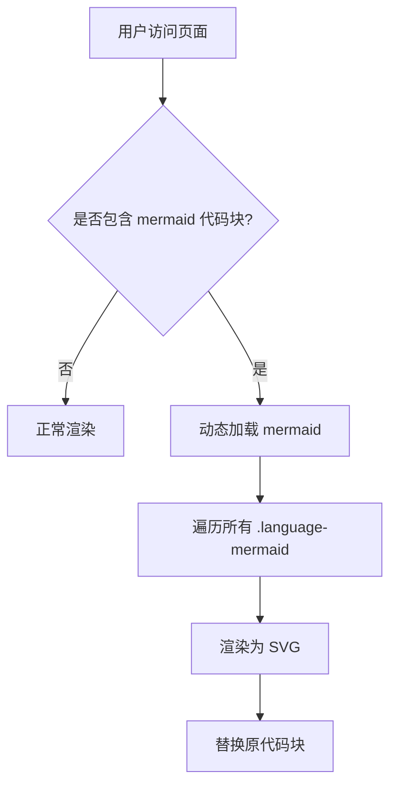
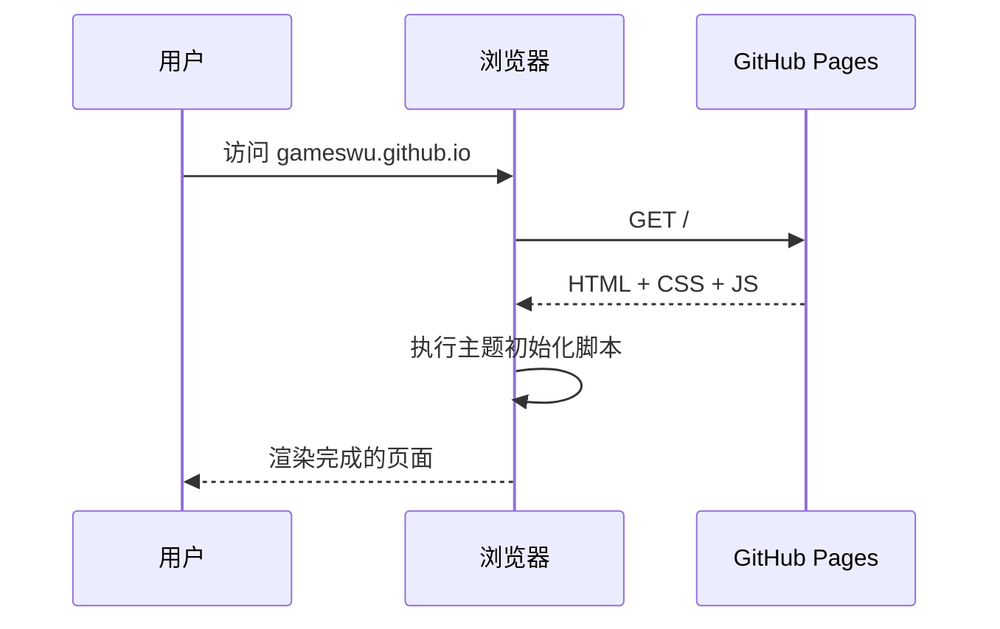
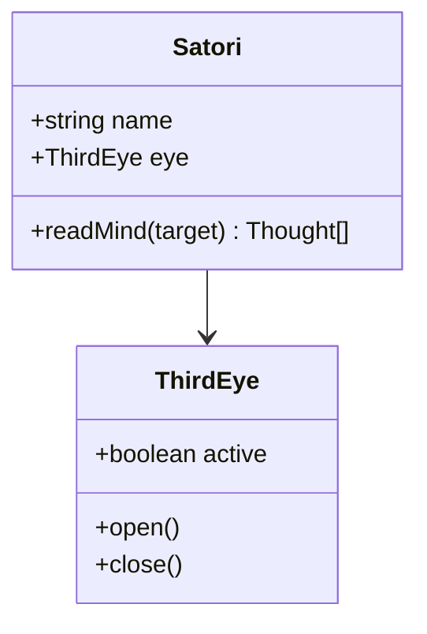

本文用于测试本博客对 Markdown 各种语法的渲染效果。如有显示异常，请据此页定位样式问题。

## 1. 标题层级

本节演示 h2 / h3 / h4。

### 这是三级标题

#### 这是四级标题

正文继续。标题旁悬停时应出现 `#` 锚点图标。

## 2. 文本格式

这是一段**粗体**、*斜体*、***加粗斜体***、~~删除线~~、`行内代码`、[外部链接](https://astro.build) 混合的段落。行内代码应有与主题色协调的淡底。

> 引用块：古明地觉是东方 Project 中居住于地灵殿的少女，拥有读心的能力。
>
> 多段引用：引用块应有左侧强调色粗边 + 软底色背景。

## 3. 列表

### 无序列表

- 第一项
- 第二项
  - 嵌套子项 A
  - 嵌套子项 B
    - 更深一层
- 第三项

### 有序列表

1. 先做 A
2. 再做 B
3. 然后做 C
   1. C 的第一步
   2. C 的第二步

### 任务列表

- [x] 已完成的任务
- [x] 另一项已完成
- [ ] 未完成的任务
- [ ] 还有一项未完成

## 4. 代码块

行内代码：`const answer = 42;`

TypeScript 代码块：

```typescript
/** 读取他人内心的函数 */
interface Thought {
  content: string;
  emotion: 'joy' | 'sorrow' | 'fear' | 'anger';
}

function readMind(target: string): Thought[] {
  // 第三只眼开启
  console.log(`正在读取 ${target} 的内心...`);
  return [
    { content: '今天吃什么好呢', emotion: 'joy' },
    { content: '不要看我的内心！', emotion: 'fear' },
  ];
}

const thoughts = readMind('河童');
thoughts.forEach((t) => console.log(t));
```

Shell 代码块：

```bash
# 克隆博客源码
git clone https://github.com/gameswu/gameswu.github.io.git
cd gameswu.github.io

# 安装依赖 & 启动开发服务器
npm install
npm run dev
```

Python 代码块：

```python
def fibonacci(n: int) -> int:
    """经典递归斐波那契，仅供展示。"""
    if n < 2:
        return n
    return fibonacci(n - 1) + fibonacci(n - 2)

for i in range(10):
    print(fibonacci(i))
```

无语言标识的代码块：

```
纯文本代码块
没有语法高亮
但应保留等宽字体和滚动条
```

## 5. 表格

| 能力       | 描述                             | 强度 |
| ---------- | -------------------------------- | :--: |
| 读心       | 通过第三只眼读取他人内心想法     |  S   |
| 操纵怨念   | 能操纵地底怨念动物的情感         |  A   |
| 飞行       | 借助念力短距悬浮                 |  B   |
| 日常生活   | 照顾火焰猫燐和灵乌路空           |  —   |

## 6. 分隔线与链接

---

参考资料：

- [东方 Project 官方](https://touhou-project.news/)
- [Astro 文档](https://docs.astro.build)
- 内部链接：[回到关于页](/about)

## 7. Mermaid 流程图

以下代码块会被客户端渲染为流程图：



序列图：



类图：



## 8. 数学公式

行内：当 $a \ne 0$ 时，方程 $ax^2 + bx + c = 0$ 的解为 $x = \frac{-b \pm \sqrt{b^2 - 4ac}}{2a}$。

块级公式（高斯积分）：

$$
\int_{-\infty}^{\infty} e^{-x^2} \, dx = \sqrt{\pi}
$$

矩阵与求和：

$$
A = \begin{pmatrix} 1 & 2 \\ 3 & 4 \end{pmatrix}, \quad \sum_{i=1}^{n} i = \frac{n(n+1)}{2}
$$

## 9. 图片

文章封面由 frontmatter `cover` 字段决定；正文图片推荐使用**相对当前文章目录**的路径，
Astro 会自动把它交给 Vite 图片管线，产出带哈希的 `_astro/xxx.png`，有长期缓存。


## 10. HTML 原生元素

<details>
<summary>点击展开 / 收起</summary>

这是一段被折叠的内容，使用 HTML `<details>` 元素实现，在 Markdown 中原生支持。

- 可以在里面写列表
- 也可以写 **粗体**
- 甚至可以 `code`

</details>

<kbd>Ctrl</kbd> + <kbd>K</kbd> 打开搜索。

## 11. 剧透（隐藏文字块）

把鼠标移到黑框上（或用 Tab 聚焦）才会显现内容：

- 结局：<span class="spoiler" tabindex="0">古明地觉最后读懂了自己的心</span>
- 关键道具：<span class="spoiler" tabindex="0">第三只眼</span>

## 12. 脚注（参考文献式）

地灵殿位于旧地狱遗址的最深处[^chireiden]，是怨灵与厌恶人类的妖怪们的居所。古明地觉的能力是「读心」[^satori]，她能直接读取对方内心的声音——这正是大多数妖怪都恐惧她的原因。

[^chireiden]: 《东方地灵殿 ～ Subterranean Animism》，ZUN，上海爱丽丝幻乐团，2008。
[^satori]: 古明地觉的种族即为"觉"（さとり），一种能读心的妖怪，参见《东方求闻口授》。

## 13. 结尾

如果你能看到这里，且上述所有元素都正常渲染 —— 包括 Mermaid 图、代码块、表格、引用、任务列表 —— 那么本博客的 Markdown 渲染层已验证通过。

> 「所有的思绪，皆可被读取」 —— 古明地觉
